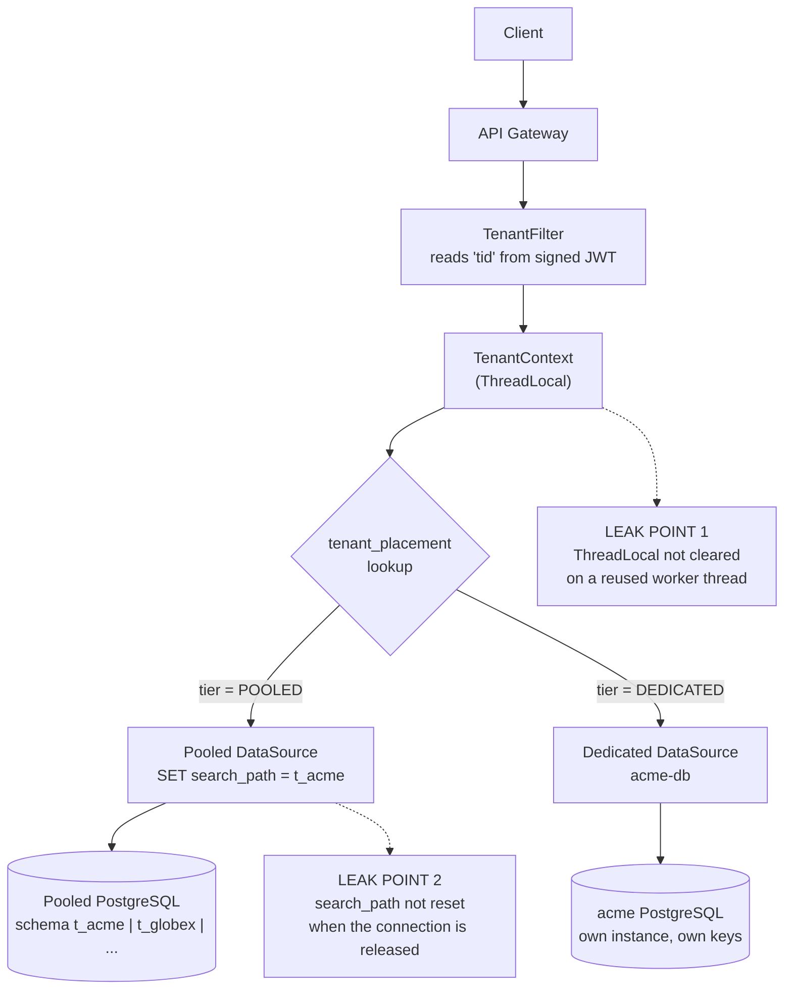
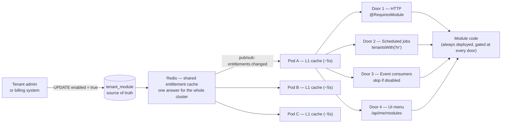
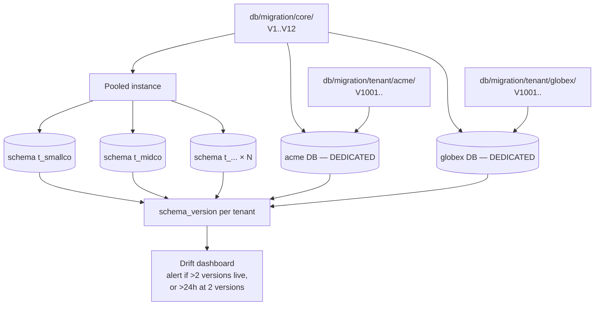

# Part 1 — Multi-Tenant / Plugin Architecture

## Framing

Two constraints in the brief drive every decision below, so I'll name them before the design.

**The tenants are independent organizations, and some of them will be competitors.** This is a franchise product, not a SaaS with one shared customer base. That changes the weighting: blast radius and data residency matter more than they would if all tenants were divisions of one company. "Tenant A briefly saw Tenant B's data" is a recoverable bug in some products and a terminal event in this one.

**The product has to be sellable at more than one price point.** A 5-seat client and a 5,000-seat client both need to be profitable. That rules out any design where per-tenant infrastructure cost has a high floor.

These two pull in opposite directions — isolation costs money — and most of what follows is about where I put that line.

Assumed stack: Java/Spring Boot on AKS, PostgreSQL. The design ports to SQL Server with one substitution: `SET search_path` becomes schema-qualified access or a per-tenant user with a default schema.

---

## 1. How I'd split tenant data

**A tiered model: schema-per-tenant in a pooled database by default, a dedicated database for tenants who need it.**

### The control plane

One registry is genuinely shared across everything. It's small, it's the only shared-everything component, and it's the thing I'd protect hardest:

```sql
CREATE TABLE tenant (
  id          UUID PRIMARY KEY,
  key         TEXT UNIQUE NOT NULL,       -- 'acme'
  status      TEXT NOT NULL               -- ACTIVE | READ_ONLY | SUSPENDED
);

CREATE TABLE tenant_placement (
  tenant_id       UUID PRIMARY KEY REFERENCES tenant(id),
  tier            TEXT NOT NULL,          -- POOLED | DEDICATED
  datasource_key  TEXT NOT NULL,          -- 'pool-sea-1' | 'dedicated-acme'
  schema_name     TEXT NOT NULL,          -- 't_acme'
  region          TEXT NOT NULL
);
```

Everything else — every business table — lives inside a tenant's schema or a tenant's database. Nothing in the data plane is shared.

### The two tiers

**Pooled (default).** One PostgreSQL instance, one schema per tenant. Isolation is real at the query level: a tenant's tables are not visible from another tenant's schema. Cost per tenant is a schema, not a server, so small clients are profitable. Per-tenant custom tables are natural because they live in that tenant's own schema.

**Dedicated.** The tenant's own database. This is what I'd sell — or require — when a client has a data-residency clause, needs their own encryption keys, needs point-in-time restore of only their own data, wants DDL rights for a custom module, or is simply large enough to be a noisy neighbour.

The tier is a property in the placement table, not a fork in the codebase. Application code asks "where does this tenant live?" and gets an answer; it does not branch on tier.

### How a request finds the right data

Tenant identity comes from a signed JWT claim issued by the IdP — **never from a header or a path segment the client controls**, because those are trivially forged and the entire isolation model rests on this one value being trustworthy.

```java
// Illustrative. One place resolves identity; nothing downstream re-derives it.
@Component
@Order(Ordered.HIGHEST_PRECEDENCE)
class TenantFilter extends OncePerRequestFilter {
    protected void doFilterInternal(HttpServletRequest req, HttpServletResponse res, FilterChain chain)
            throws ServletException, IOException {
        UUID tenantId = jwt.requiredClaim(req, "tid");
        TenantContext.set(tenantId);
        try {
            chain.doFilter(req, res);
        } finally {
            TenantContext.clear();   // not optional — see the risk section
        }
    }
}
```

That `finally` is load-bearing. Tomcat reuses worker threads. If the `ThreadLocal` survives the response, the next request on that thread inherits the previous tenant's identity — a cross-tenant leak with no bug anywhere in the business logic.

Routing then resolves both the datasource and the schema:

```java
// Illustrative.
class TenantRoutingDataSource extends AbstractRoutingDataSource {
    protected Object determineCurrentLookupKey() {
        return placement.lookup(TenantContext.require()).datasourceKey();
        // POOLED   -> "pool-sea-1"
        // DEDICATED-> "dedicated-acme"
    }
}

// For pooled tenants, select the schema as the connection is checked out.
Connection getConnection() throws SQLException {
    Connection c = delegate.getConnection();
    Placement p = placement.lookup(TenantContext.require());
    if (p.tier() == POOLED) {
        try (Statement s = c.createStatement()) {
            s.execute("SET search_path TO " + quoteIdentifier(p.schemaName()));
            s.execute("SET app.tenant_id = " + quoteLiteral(p.tenantId()));
        }
    }
    return c;
}
```

### Why this split

Because the two tiers let me price the product across the range the brief implies while giving the clients who actually need physical isolation a real answer, rather than a promise that a `WHERE` clause will hold. And because schema-per-tenant is the only pooled model that has a natural answer to question 4 — a custom table for one tenant is just a table in that tenant's schema.

### Where it's weak

- **`search_path` is connection state, and connections are pooled.** It has to be reset when the connection goes back, or the next borrower inherits it. That's an extra round-trip on checkout and release. At high throughput it's measurable, and the mitigations (pgbouncer in transaction mode, or a session-setup hook in HikariCP) are extra moving parts.
- **Pool-per-tenant doesn't scale, so the pool is shared.** 300 tenants × 10 connections is 3,000 connections, and PostgreSQL degrades well before that. So tenants share a connection pool, which means the isolation is enforced by discipline at checkout — not by the database refusing.
- **Two tiers means two of everything operationally.** Two backup and restore runbooks, two monitoring configurations, two migration targets. Every operational procedure I write, I write twice.
- **There is a promotion path I have to build and won't need on day one.** Moving a tenant from pooled to dedicated is real work — freeze writes for that tenant, copy, verify row counts, flip the placement row, evict the placement cache on every pod. If it isn't written and rehearsed early, it gets improvised by hand during the week a customer demands it.

### Diagram — request to data



---

## 2. The alternative I considered and rejected

**Shared database, shared schema, `tenant_id` on every row, PostgreSQL Row-Level Security (RLS) as the guard.**

> **Row-Level Security (RLS)** is a PostgreSQL feature that attaches a permanent filter to a table. Once a policy is in place, the database itself adds `AND tenant_id = <the current tenant>` to every query against that table — whether or not the application remembered to. The application can't opt out of it, and a developer writing a query by hand can't forget it. It moves tenant isolation from *something the code promises* to *something the database enforces*.

```sql
-- The rejected shape.
CREATE TABLE employee (
  id        BIGSERIAL PRIMARY KEY,
  tenant_id UUID NOT NULL,
  name      TEXT NOT NULL
);
CREATE INDEX ON employee (tenant_id, id);     -- tenant_id leads every index

ALTER TABLE employee ENABLE ROW LEVEL SECURITY;
CREATE POLICY tenant_isolation ON employee
  USING (tenant_id = current_setting('app.tenant_id')::uuid);
```

This is a genuinely good design and I don't want to strawman it. It is the cheapest per tenant, it has exactly one migration to run, one backup to take, one set of indexes to tune, and RLS makes the isolation a database guarantee rather than an application convention.

**I rejected it on two grounds, both traceable to the brief.**

*Blast radius.* One database holds every client organization. A bad query plan, a lock, a runaway report, or a full disk is a platform-wide incident affecting companies that may compete with each other. And "please restore our data to yesterday 3pm" means restoring a database containing 400 other tenants — so the real answer becomes a selective export-and-merge under time pressure, which is exactly the operation you don't want to invent during an incident.

*It has no clean answer to question 4.* The brief says some tenants will want custom modules. In a shared schema, a custom table for one tenant is a table every tenant carries forever, and a custom column is a column in everyone's table. Over a few years of franchise sales, the core schema accumulates other people's requirements permanently. That's not a limitation I can design around; it's structural.

**What would make me pick it instead.** If the product turned out to be self-serve rather than franchise — thousands of small tenants signing up with a credit card, no data-residency clauses, no per-tenant DDL, no third-party modules — then per-tenant cost dominates every other consideration, one migration genuinely beats four hundred, and shared-schema with RLS and disciplined composite indexing is the correct answer. The deciding question is not technical: it's whether the sales motion produces many small tenants or few large ones. If the go-to-market shifted that way, I'd switch, and I'd want to switch before tenant count made the migration painful.

---

## 3. Turning a module on or off without redeploying

**The code for every module is always deployed. Enabling a module is one row change.**

That's the whole mechanism. No classloading, no dynamic deployment, no restart — the capability was already in the image, and what changes is whether the platform lets this tenant reach it.

```sql
CREATE TABLE tenant_module (
  tenant_id   UUID    NOT NULL REFERENCES tenant(id),
  module_key  TEXT    NOT NULL,          -- 'hr' | 'procurement' | 'crm'
  enabled     BOOLEAN NOT NULL DEFAULT false,
  config      JSONB   NOT NULL DEFAULT '{}',   -- per-tenant module settings
  enabled_at  TIMESTAMPTZ,
  PRIMARY KEY (tenant_id, module_key)
);
```

### The four doors — the part that's easy to get wrong

**What "door" means here:** a way that a module's code can start running. It is natural to think of a module as a set of screens, so "turning it off" sounds like hiding the menu item. It isn't. A module's code can be triggered by four independent things, and hiding the menu stops only one of them.

Picture the module as a building with four entrances. Locking the front door feels like you've closed the building. But the loading dock is still open, the back stairwell is still open, and the mail slot is still accepting deliveries. Anyone — or any event — coming in that way walks straight into the module.

The four entrances are:

| # | Door | What triggers it | What happens if you forget to guard it |
|---|---|---|---|
| 1 | **HTTP endpoint** | A user or an integration calls `/api/hr/employees` | The tenant's menu shows no HR, but anyone who knows the URL can still call the API and read or write HR data |
| 2 | **Scheduled job** | A timer inside the app fires at 02:00 | A nightly payroll job runs for a tenant who doesn't have HR — creating records, sending emails, touching data the tenant never bought |
| 3 | **Event/queue consumer** | A message arrives on Kafka from another module | A disabled module keeps reacting to events and silently writing data, invisibly, for months |
| 4 | **UI menu** | The front end asks the server what to render | The tenant sees a feature they haven't paid for, clicks it, and gets an error — a support ticket and a bad first impression |

So yes — these are the **vulnerable points of the design**. Not vulnerabilities in the sense of a security hole an attacker exploits (though door 1 is exactly that), but in the sense that *the feature toggle is only as true as its least-guarded entrance*. If one is missed, the module is "off" in the product's own admin screen while still running in reality — which is worse than being obviously on, because nobody is looking for it.

This is where module gating fails in practice. The common failure is that a team guards door 1, ships, and six months later discovers the disabled module's queue consumer has been quietly processing that tenant's events the entire time. The fix is not vigilance; it's making each door's guard *declarative and greppable*, so a reviewer can check all four in one search, and so adding a fifth kind of entry point later forces an explicit decision.

```java
// Door 1 — HTTP. Declarative, so it's visible in review.
@Retention(RUNTIME) @Target({METHOD, TYPE})
public @interface RequiresModule { String value(); }

@RestController
@RequestMapping("/api/hr")
@RequiresModule("hr")
class EmployeeController { /* ... */ }

@Aspect @Component
class ModuleGuard {
    @Before("@within(rm) || @annotation(rm)")
    void check(RequiresModule rm) {
        if (!registry.isEnabled(TenantContext.require(), rm.value()))
            throw new ModuleNotEnabledException(rm.value());
    }
}
```

```java
// Door 2 — scheduled jobs. Iterate entitled tenants, never all tenants.
@Scheduled(cron = "0 0 2 * * *")
void nightlyPayrollAccrual() {
    for (UUID tenantId : registry.tenantsWith("hr")) {
        TenantContext.runAs(tenantId, payroll::accrue);
    }
}

// Door 3 — event and queue consumers. The most-forgotten door.
@KafkaListener(topics = "invoice.created")
void onInvoiceCreated(InvoiceEvent e) {
    if (!registry.isEnabled(e.tenantId(), "procurement")) return;
    procurement.handle(e);
}

// Door 4 — the UI. The shell asks what to render; it doesn't hardcode a menu.
@GetMapping("/api/me/modules")
List<ModuleDescriptor> myModules() {
    return registry.enabledFor(TenantContext.require());
}
```

**404 rather than 403** for a disabled module. A 403 confirms the endpoint exists, which hands an attacker a map of the platform's full module surface from any tenant's credentials. The cost of choosing 404 is that a tenant admin debugging a misconfiguration gets a less helpful error, so the distinction has to be visible in the admin console instead. It's a deliberate trade, not an accident.

### Diagram — one row, four enforcement points



### Caching, and the honest consequence

`isEnabled` runs on every request, so it's cached. The service runs several pods. Therefore a toggle is **not instantaneous across the cluster** — pod 3 can still be serving the old answer.

```java
@Cacheable(cacheNames = "entitlements", key = "#tenantId")
Set<String> enabledFor(UUID tenantId) { /* ... */ }
```

The unacceptable answer is to leave this undefined and let support field the "I turned it on and nothing happened" tickets. The question is which defined answer to pick.

**A per-pod cache with a TTL** is the simplest: each pod caches for 60 seconds and you write *"module changes take effect within 60 seconds"* into the product contract. No new infrastructure. But the freshness guarantee is weak in a specific way that matters — it's 60 seconds **per pod, unsynchronised**, so during that window two users at the same client can get different answers depending on which pod they hit. That's confusing to explain to a customer and awkward to reproduce in support.

**Redis as a shared entitlement cache** removes that. Every pod reads the same value, so there is one answer at any moment, and an admin toggle is visible everywhere as soon as the key is written rather than whenever each pod's local timer happens to expire. For an entitlement — which is a **billing-backed fact**, not a preference — that's the right guarantee. A tenant who just paid for procurement should see it now, and a tenant whose subscription lapsed should lose access now, not "within a minute, on most pods."

I'd take Redis, in a two-level arrangement so the correctness win doesn't cost a network round-trip on every request:

```java
// Illustrative. L1 = in-process (microseconds), L2 = Redis (shared truth).
Set<String> enabledFor(UUID tenantId) {
    return l1.get(tenantId, () ->                       // ~5s TTL, absorbs request bursts
           redis.get(key(tenantId), () ->               // shared across all pods
           loadFromDatabase(tenantId)));                // cold path only
}

// The writer updates Redis and tells every pod to drop its L1 copy.
@Transactional
void setEnabled(UUID tenantId, String moduleKey, boolean enabled) {
    repo.upsert(tenantId, moduleKey, enabled);          // database is the source of truth
    redis.del(key(tenantId));                           // L2 invalidated
    redis.publish("entitlements.changed", tenantId);    // pub/sub -> every pod evicts L1
}
```

Redis pub/sub does the cluster-wide eviction, so the worst-case staleness is the L1 TTL (a few seconds) rather than a full minute, and it's the *same* few seconds everywhere.

**What this costs, stated honestly:**

- **Redis becomes a dependency in the request path.** If it's unreachable, every entitlement check would go to the database — which is survivable but is a sudden load spike on the control plane exactly when something is already wrong. So the fallback has to be designed, not discovered: serve the last-known-good L1 value past its TTL when Redis is down, and alarm on it. **Never fail open** (treating an unreachable cache as "all modules enabled") — that would hand tenants features they haven't paid for during an outage.
- **Pub/sub is fire-and-forget.** A pod that was restarting when the message went out never receives it, which is precisely why the L1 TTL stays in place as a backstop rather than being set to infinity.
- **It's another stateful component** to run, monitor, secure and patch. On AKS that's Azure Cache for Redis — a real line item and a real operational surface, justified here because the same cache serves session and rate-limit state, not by entitlements alone.
- **The database remains the source of truth.** Redis holds a derived copy. If the two ever disagree, the database wins and the cache is rebuilt — which means no toggle is ever lost because a cache write failed.

### Disabling is harder than enabling

Enabling is additive and safe. Disabling raises questions the design has to answer explicitly:

- **In-flight work.** A purchase order is half-approved when procurement is switched off. Either block the toggle while work is open, or let the in-flight item complete and stop new ones. I'd do the latter and surface the open items to the admin before confirming.
- **Queued jobs.** Work already on a queue was enqueued while the module was on. Consumers re-check entitlement at consume time, so those messages drop — which means the job must be idempotent and safe to skip.
- **Data.** Soft-disable by default: hide the module, keep the data, allow re-enable to restore it intact. Purge only on explicit request plus a grace period. A tenant who disables CRM for a quarter to save money and re-enables it expecting their pipeline back is a reasonable expectation to meet.
- **Who can toggle, and it's audited.** Enabling a paid module is a billing event; the audit trail matters as much as the mechanism.

### Why a modular monolith, and why not the alternatives

Modules live in one deployable, with boundaries that a test enforces rather than good intentions:

```java
@AnalyzeClasses(packages = "com.erp")
class ModuleBoundaryTest {
    @ArchTest
    static final ArchRule modules_do_not_depend_on_each_other =
        slices().matching("com.erp.modules.(*)..").should().notDependOnEachOther();

    @ArchTest
    static final ArchRule modules_use_only_the_platform_api =
        noClasses().that().resideInAPackage("..modules..")
            .should().dependOnClassesThat().resideInAPackage("..core.internal..");
}
```

That rule is the entire extraction strategy. The day a tenant's load forces CRM out into its own service, the seams already exist — because CI refused to let anyone cross them for the preceding two years.

### Scaling by module demand, without splitting the codebase

A fair objection to a monolith is that you can't scale a busy module independently — if procurement is hammered at month-end, you have to scale the whole application. In practice you can get most of that benefit while keeping one codebase, and it's worth being precise about how much.

**The same image is deployed several times, each with a different runtime role.** A Spring profile decides which doors that replica opens:

```yaml
# Illustrative — one image, three Deployments, different roles.
# erp-web-general : ROLES=http                 replicas 4   (everything except procurement)
# erp-web-procure : ROLES=http,module=procure  replicas 12  (month-end spike)
# erp-workers     : ROLES=jobs,consumers       replicas 2   (no HTTP traffic at all)
```

```java
@Configuration
@ConditionalOnProperty(name = "roles.jobs", havingValue = "true")
class SchedulerConfig { /* @Scheduled beans exist ONLY in this role */ }
```

The gateway routes `/api/procurement/**` to the procurement pool and everything else to the general pool. A Horizontal Pod Autoscaler then scales each pool on its own metrics, so month-end procurement load adds twelve pods to procurement and none to HR.

**What this genuinely buys:**

- **Capacity scales per module.** The expensive module gets the replicas; the quiet ones don't.
- **Partial blast-radius isolation.** A memory leak or a thread-pool exhaustion in procurement takes down the procurement pool. HR-only tenants, served by the general pool, keep working. That directly softens the "one image, shared failure" weakness noted above.
- **Background work is isolated from user traffic**, which is the higher-value split in most ERP systems — a long-running report or a nightly job can no longer starve the threads serving interactive requests.
- **No code change to get it.** It's a deployment topology decision, reversible in an afternoon, made without touching a line of application code.

**Where the claim has to stop, because overstating it would be wrong:**

- **Footprint doesn't shrink, only throughput scales.** Every replica still loads the entire application — all modules' classes, all beans, the full heap baseline. Twelve procurement pods each carry HR and CRM code they never execute. Compared to a true microservice, you're paying for memory you don't use, so the cost saving is smaller than the architecture diagram suggests.
- **Scheduled jobs must run in exactly one role.** If the `@Scheduled` beans are active in all three deployments, the nightly payroll run fires eighteen times. The `@ConditionalOnProperty` guard above is what prevents that, and it needs a leader-election or a distributed lock as a second safeguard — this is the sharpest edge in the whole arrangement and it's easy to miss.
- **Deploys stay coupled.** A hotfix to procurement still rebuilds and redeploys the one artifact. You've decoupled *scaling*, not *release cadence* — and release independence is the thing teams usually want microservices for.
- **It's more configuration to reason about.** Three deployments, three autoscaler configs, and a gateway routing table that must stay in step with the module list.

So the honest framing is: **this covers the scaling argument for module-per-service, but not the release-independence or footprint arguments.** When a module needs its own deploy schedule or its own memory profile, that's the signal to extract it — and the ArchUnit boundaries above are what make that extraction a week's work instead of a quarter's.

**Rejected: dynamic classloading (OSGi-style).** Loading a JAR at runtime is four lines. *Unloading* is the problem: every reference has to go — cached classes, thread-locals, registered JDBC drivers, Spring beans the module created. Miss one and the classloader can't be collected, and after enough cycles the pod dies of metaspace exhaustion. OSGi spent two decades on this and Spring Boot's flat-classpath assumption fights you the whole way. More to the point, it solves a problem that no longer exists: dynamic loading mattered when redeploying meant a long outage. On AKS a rolling image update is ninety seconds with no downtime. I'd be paying a permanent complexity tax for a capability Kubernetes already gives me.

**Rejected for now: module-per-service.** Real isolation and independent release cadence, and I expect to end up here for one or two modules eventually. Not yet, for three reasons. A purchase order that updates budget and inventory is currently one database transaction, and splitting it makes it a saga with compensating actions — a large correctness cost paid before there's a problem to justify it. Every developer's laptop would need six services running to debug one feature. And the most commonly cited reason to split — independent scaling — is largely available already through the role-based deployment topology above, without paying either of those costs. What role-based deployment *doesn't* give me is independent release cadence and a smaller per-pod footprint, so those are the conditions I'd watch for as the real trigger to extract a module.

### Where this is weak

Every tenant's image contains every module's code, including modules they don't own. Role-based deployment pools limit the fallout — a procurement defect takes down the procurement pool, not the general one — but it doesn't eliminate it, and every replica still carries the memory footprint of modules it never runs. Module tables exist in every schema whether or not the module is enabled. Entitlement freshness now depends on Redis being healthy, with a designed fallback rather than an assumed one. And the gating is only as good as the least-guarded door, which is a discipline problem that recurs every time someone adds a new entry point.

---

## 4. A database change for one tenant's custom module

### First: third-party modules don't get my schema at all

The brief says some tenants will want modules built by third parties. My position is that **third-party code runs out of process**, and that decision answers most of this question before it's asked: a third-party module's data lives in the third party's own store. There is no schema change on my side, for any number of third-party modules, ever.

They get three things: signed webhooks for my domain events, a scoped REST API to call back into, and sandboxed UI extension slots.

```java
// Illustrative. Their outage must not become my outage.
@Async
void dispatch(DomainEvent e) {
    for (WebhookSubscription sub : subs.find(e.tenantId(), e.type())) {
        webClient.post().uri(sub.url())
            .header("X-Signature", hmacSha256(sub.secret(), e))  // they verify it's me
            .bodyValue(e)
            .retrieve().toBodilessEntity()
            .timeout(Duration.ofSeconds(3))
            .onErrorResume(ex -> { deadLetter(sub, e); return Mono.empty(); })
            .subscribe();
    }
}
```

Their API token is OAuth client-credentials, scoped to **one tenant and one module's data** — so a compromised partner credential is bounded to the client who installed it.

**Why not in-process plugins.** Java no longer has a working sandbox. `SecurityManager` is deprecated and on its way out, and nothing replaces it. Foreign code inside my JVM can read the connection pool's credentials, call any internal service, and reach other tenants' objects on the heap. "We review the plugin before installing it" reduces, honestly stated, to "we trust the vendor" — and code review does not reliably catch deliberate misuse. On top of that, the moment a third party writes `implements ErpModule`, my internal interface becomes a public API I can't refactor.

**What out-of-process costs, plainly.** They can't join their data to mine in a single query, which makes combined reporting harder. They can't participate in my transactions, so cross-boundary consistency is eventual. And they can't extend a core screen's server-side behaviour — only react to events and add their own surfaces. For some ERP customization requests, that's a real "no." I'd rather give a real no than an unsafe yes.

### Second: custom fields, without any DDL

The out-of-process boundary doesn't cover "this tenant needs one extra field on the employee record." Standing up a service for that is absurd. So:

```sql
ALTER TABLE employee ADD COLUMN ext JSONB NOT NULL DEFAULT '{}';
CREATE INDEX employee_ext_gin ON employee USING gin (ext);
```

Tenant-defined fields are validated on write against a JSON Schema stored in that tenant's `tenant_module.config`. No migration, no per-tenant DDL, and it covers the large majority of real custom-field requests. The cost is honest: weaker typing than a real column, no foreign keys, and queries filtering on `ext` are slower and harder to plan than a native column. If a tenant's `ext` usage grows into something that needs joins and constraints, that's the signal it should have been a real table.

### Third: real DDL, in an isolated lane

When a tenant genuinely needs their own tables, migrations run in two lanes:

```text
db/migration/core/            V12__add_invoice_status.sql       → every tenant
db/migration/tenant/acme/     V1001__acme_site_hierarchy.sql    → acme only
```

```java
// Illustrative. Core lane first, then the tenant's own lane.
Flyway.configure()
      .dataSource(ds(tenant))
      .schemas(tenant.schemaName())
      .locations("db/migration/core", "db/migration/tenant/" + tenant.key())
      .load()
      .migrate();
```

Two conventions keep the lanes from colliding: **tenant migrations are numbered from 1000 up**, so the core lane can grow for years without ever reaching them; and **custom tables and columns use an `x_` prefix**, reserved forever, so a future core migration can't collide with one a partner created three years earlier.

**Per-tenant DDL is a dedicated-tier privilege.** Arbitrary DDL inside the pooled database is how one tenant's unreviewed index or wide table degrades the instance serving two hundred others. A pooled tenant who needs real DDL gets promoted to dedicated first — which is the point of having the tier boundary at all.

### Diagram — migration fan-out



### The failure mode I have to admit

A core migration runs across 400 schemas and succeeds on 388. Twelve fail — perhaps their `ext` data violates a new constraint. Now the fleet sits at mixed versions: I can't roll forward (twelve are broken) and I can't roll back (388 have already applied it). That's a mid-business-hours incident with no good exit.

Three things keep it survivable:

1. **Expand/contract on every change.** Never make old code incompatible with the new schema.

   ```sql
   -- V41 (expand): nullable, no constraint. Old code ignores it entirely.
   ALTER TABLE invoice ADD COLUMN status TEXT;
   -- deploy code that writes both, reads old → backfill in batches → deploy code that reads new
   -- V43 (contract): only after every tenant is confirmed at V42.
   ALTER TABLE invoice ALTER COLUMN status SET NOT NULL;
   ```

   Between those steps a stranded tenant still works. Drift stops being an incident and becomes a dashboard item.

2. **Migrations are a gated pipeline stage, never an application-startup side effect.** Six pods booting simultaneously would each try to migrate four hundred schemas.

3. **A per-tenant `schema_version` record with alerting on drift**, so mixed-version states are visible within minutes rather than discovered by a customer.

This orchestration is more expensive than the single migration a shared schema would need. That cost is the price of the tier model, and it's the strongest argument for the alternative in section 2.

---

## 5. The single biggest risk

**A cross-tenant data leak.**

### Why this one

It's the only risk in this design that is both silent and unrecoverable. A migration failure is loud, a performance problem is measurable, an eroded module boundary is annoying but fixable. A leak produces no error, no alert, and no failed health check — the system works perfectly and returns the wrong company's data. You find out when a client emails a screenshot of a competitor's payroll. For a product sold to independent organizations, that single email can end the product regardless of how quickly it's patched.

### Where it actually comes from

Not from a developer forgetting a `WHERE` clause — that's the version people design against, and schema-per-tenant largely removes it. In this design leaks come from **tenant identity stored in something reusable that wasn't cleaned up**:

1. **A pooled connection** still pointing at the previous tenant's `search_path`. The next borrower runs correct queries against the wrong schema.
2. **A pooled thread** whose `TenantContext` wasn't cleared, so the next request on that thread inherits an identity before the filter sets it.
3. **An async or background job**, which has no request to inherit identity from. Someone passes a tenant id by hand, and one day passes the wrong one — or a `@Async` method silently loses the `ThreadLocal` entirely and reads whatever is there.

All three are infrastructure-level mistakes, invisible in a code review of business logic.

### Catching it early — no single point of failure

The principle is that one mistake must never be sufficient.

**Row-Level Security (RLS) as a second lock, kept even though schemas already separate tenants.** RLS is the PostgreSQL feature described in section 2 — the database attaches a permanent tenant filter to every query, independent of what the application asks for. Here it's deliberate redundancy: the schema separation is the primary lock, and RLS is the one that holds if the primary fails.

```sql
ALTER TABLE employee ENABLE ROW LEVEL SECURITY;
CREATE POLICY tenant_isolation ON employee
  USING (tenant_id = current_setting('app.tenant_id')::uuid);
```

With `app.tenant_id` set on the same connection as `search_path`, a query that somehow reaches the wrong schema returns **zero rows instead of someone else's rows**. Wrong, but safe — and a query returning nothing gets reported as a bug immediately, whereas a query returning plausible data does not.

**Tests that fail the build:**

```java
// Illustrative. Run across every repository, not a sampled few.
@Test
void repositories_never_cross_tenant_boundaries() {
    TenantContext.set(TENANT_A);
    var a = employeeRepo.findAll();
    TenantContext.set(TENANT_B);
    var b = employeeRepo.findAll();
    assertThat(a).doesNotContainAnyElementsOf(b);
}

@Test
void connection_state_is_reset_on_return_to_pool() {
    try (Connection c = pool.getConnection()) { /* used as tenant A */ }
    try (Connection c = pool.getConnection(); Statement s = c.createStatement()) {
        ResultSet rs = s.executeQuery("SHOW search_path");
        rs.next();
        assertThat(rs.getString(1)).isEqualTo("public");
    }
}
```

**Make the async case structurally impossible rather than a rule people remember.** `TenantContext.runAs(tenantId, work)` is the only sanctioned way to start background work, and an ArchUnit rule fails the build on any direct `ExecutorService.submit` or bare `@Async` inside a module package. A convention enforced by CI survives staff turnover; one enforced by code review does not.

### Reducing it once it's live

- **Canary rows.** Every tenant has a sentinel record. A response-body scanner in staging, and sampled in production, alerts if a response served to tenant A ever contains tenant B's canary. This catches the case where all the unit tests pass and the leak comes from a cache key, a shared static, or a serialization path nobody tested.
- **Tenant id on every log line and every trace span.** When a leak is suspected, the question is always "who else was affected and for how long," and without that tagging it's unanswerable — which turns a contained incident into a disclosure to every client.
- **Blast radius as a product feature.** A leak between a dedicated tenant and anyone else is physically impossible — different databases, different credentials. That's a significant part of why the tier model was chosen, and it's a legitimate answer to give a security-conscious prospect during a sales cycle.
- **Rehearse the response, not just the prevention.** Who gets notified, in what order, within what contractual window. A leak discovered on a Friday with no runbook becomes two incidents.

### The runner-up, stated so this doesn't read as a one-risk design

The second risk is the operational debt of my own tier choice: two runbooks for everything, and a pooled→dedicated promotion path that isn't needed on day one and therefore tends never to get written — until a customer's contract requires it that week and someone improvises it by hand at 2am with `pg_dump`, mis-sets a sequence, and produces duplicate-key errors in production the next morning. The mitigation is unglamorous: write the promotion procedure early, even crudely, and rehearse it against a real tenant in staging once a quarter.

```java
// Illustrative. Deliberately boring — correctness over speed.
void promote(UUID tenantId) {
    tenantStatus.set(tenantId, READ_ONLY);            // freeze writes for THIS tenant only
    awaitInFlightTransactions(tenantId);
    copySchema(tenantId, pooledDb, dedicatedDb);
    verifyRowCountsAndSequences(tenantId, pooledDb, dedicatedDb);  // verify before switching
    placement.moveTo(tenantId, dedicatedDb);
    evictPlacementCacheOnAllPods(tenantId);           // or pods keep routing to the old home
    tenantStatus.set(tenantId, ACTIVE);
    // old schema retained read-only for 7 days as the rollback path
}
```

---

## Summary of the trade

| Decision | What it buys | What it costs |
|---|---|---|
| Tiered: pooled schemas + dedicated DBs | Sellable across price points; a real isolation story for regulated clients | Two of every runbook; a promotion path to build and rehearse |
| Rejected shared-schema + RLS | Avoids platform-wide blast radius; leaves room for per-tenant DDL | Gives up the cheapest per-tenant cost and the single-migration simplicity |
| Entitlement registry, modules always deployed | Toggle without redeploy; trivial mechanism; no classloader risk | Every tenant carries every module's code; four doors to guard |
| Redis-backed entitlement cache (L1 + L2) | One answer cluster-wide; a billing-backed fact is fresh everywhere at once | Redis in the request path; a fallback that must be designed, never fail-open |
| Modular monolith with CI-enforced boundaries | One transaction, one dev environment, extraction stays possible | Boundaries hold only while the CI rules do |
| Role-based deployment pools (one image, many roles) | Per-module scaling and partial blast-radius isolation with no code change | Footprint doesn't shrink; release cadence stays coupled; scheduled jobs must run in exactly one role |
| Out-of-process third-party modules | No foreign code in my JVM; bounded credential scope | No cross-boundary joins or transactions; some customizations are simply "no" |
| `ext` JSONB + per-tenant migration lane | Custom fields with no DDL; custom tables without touching other tenants | Weaker typing; migration fan-out and drift to manage |
