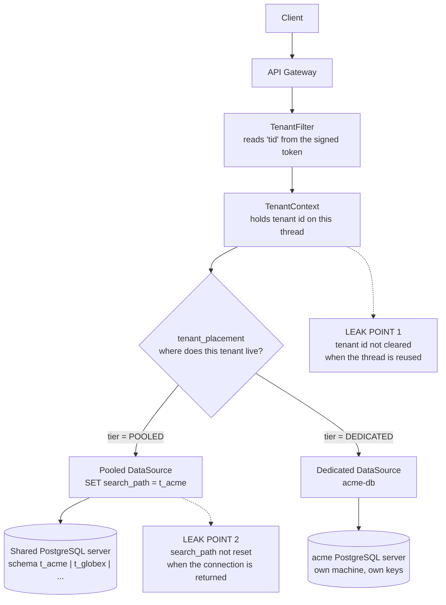
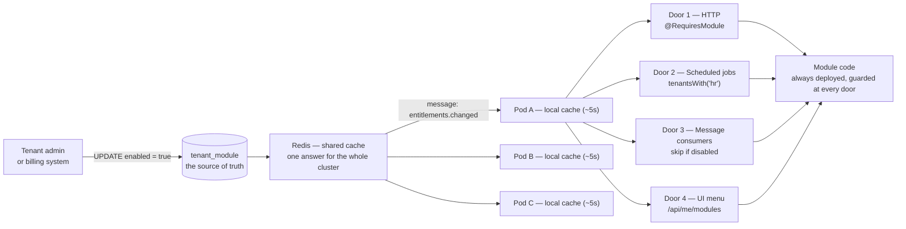
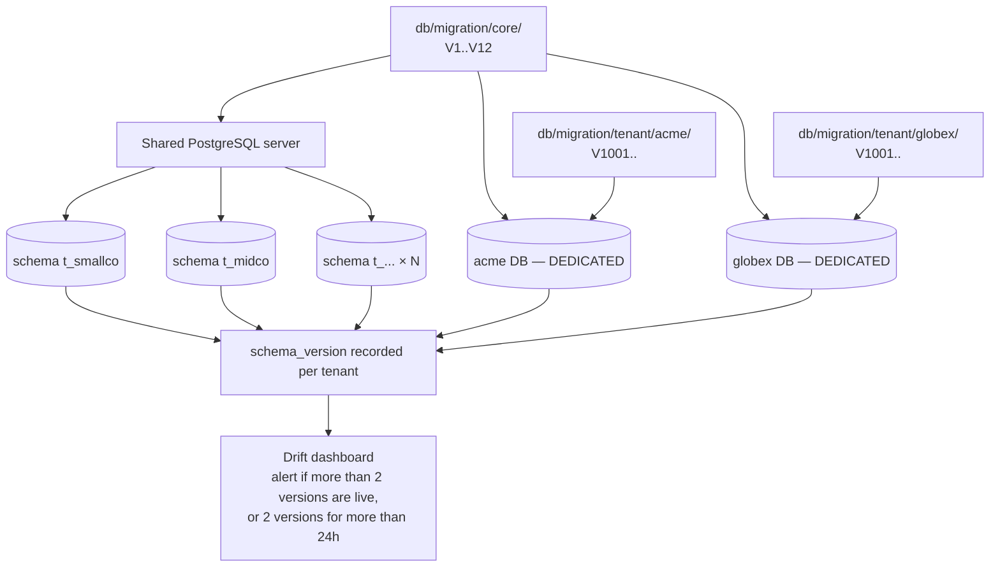

# Part 1 — Multi-Tenant / Plugin Architecture

A note on terms: this answer explains each technical term the first time it is used. The engineering is not simplified. Only the wording is.

**Tenant** means one client organization using the platform. **Multi-tenant** means many client organizations share one running system.

---

## Framing

Two facts in the brief shape every decision below. I want to state them first, because they explain the choices.

**Fact one: the tenants are separate companies, and some of them compete with each other.** This product is sold to independent client organizations. It is not one company with many departments. So the damage from a mistake is different. If two departments of one company briefly see each other's data, that is a bug. If two competing companies see each other's data, that can end the product.

**Fact two: the product must be sellable at different prices.** A client with 5 users and a client with 5,000 users must both be profitable. So the design cannot have a high fixed cost per tenant.

These two facts pull in opposite directions. Stronger isolation costs more money. Most of this answer is about where I draw that line.

Assumed technology: Java with Spring Boot, running on Azure Kubernetes Service (AKS), with PostgreSQL as the database. AKS is Microsoft's managed Kubernetes, which runs the application as a set of identical copies called **pods**. The design also works on SQL Server. Only one detail changes, and I note it where it comes up.

---

## 1. How I would split tenant data

**My answer: two tiers. Most tenants share one database but get their own schema inside it. Tenants who need more get their own separate database.**

A **schema** in PostgreSQL is a named folder of tables inside one database. Two schemas in the same database can each hold a table called `employee`, and those two tables are completely separate.

### The control plane

One small registry is shared by everything. It is the only truly shared part of the system, so it is the part I would protect hardest.

```sql
CREATE TABLE tenant (
  id          UUID PRIMARY KEY,
  key         TEXT UNIQUE NOT NULL,       -- 'acme'
  status      TEXT NOT NULL               -- ACTIVE | READ_ONLY | SUSPENDED
);

CREATE TABLE tenant_placement (
  tenant_id       UUID PRIMARY KEY REFERENCES tenant(id),
  tier            TEXT NOT NULL,          -- POOLED | DEDICATED
  datasource_key  TEXT NOT NULL,          -- 'pool-sea-1' | 'dedicated-acme'
  schema_name     TEXT NOT NULL,          -- 't_acme'
  region          TEXT NOT NULL
);
```

This registry answers one question: *where does this tenant's data live?* Every business table lives inside a tenant's own schema or a tenant's own database. No business data is shared.

### The two tiers

**Pooled tier (the default).** One PostgreSQL server. One schema per tenant. The isolation is real: a tenant's tables cannot be seen from another tenant's schema. The cost per tenant is one schema, not one server. So small clients are still profitable. Custom tables are easy, because a custom table just goes in that tenant's own schema.

**Dedicated tier.** The tenant gets their own database server. I would sell this, or require it, when a client:

- has a contract saying their data must stay in a named country,
- wants their own encryption keys,
- wants to restore only their own data to an earlier point in time,
- wants the right to add their own tables,
- or is simply large enough to slow everyone else down.

The tier is just a value in the placement table. It is not a fork in the code. The application asks "where does this tenant live?" and gets an answer. It never writes `if (tier == DEDICATED)`.

### How a request finds the right data

The tenant identity comes from the login token. We use a **JWT**, which is a JSON Web Token — a small signed block of data issued by the identity provider when the user logs in. Because it is signed, the client cannot change it.

**The tenant identity must never come from something the client controls**, such as a header or a part of the URL. Those are trivial to fake. The entire isolation design rests on this one value being trustworthy.

```java
// Illustrative. One place decides who you are. Nothing else re-decides it.
@Component
@Order(Ordered.HIGHEST_PRECEDENCE)
class TenantFilter extends OncePerRequestFilter {
    protected void doFilterInternal(HttpServletRequest req, HttpServletResponse res, FilterChain chain)
            throws ServletException, IOException {
        UUID tenantId = jwt.requiredClaim(req, "tid");
        TenantContext.set(tenantId);
        try {
            chain.doFilter(req, res);
        } finally {
            TenantContext.clear();   // not optional — see section 5
        }
    }
}
```

That `finally` block matters more than it looks. The web server does not create a new thread for every request. It keeps a set of threads and reuses them. `TenantContext` stores the tenant id on the current thread. If we do not clear it, the next request handled by that same thread starts with the previous tenant's identity already set. That is a data leak between two companies, and there is no bug anywhere in the business code. Section 5 returns to this.

Next, the system picks the right database and the right schema.

```java
// Illustrative.
class TenantRoutingDataSource extends AbstractRoutingDataSource {
    protected Object determineCurrentLookupKey() {
        return placement.lookup(TenantContext.require()).datasourceKey();
        // POOLED    -> "pool-sea-1"
        // DEDICATED -> "dedicated-acme"
    }
}

// For pooled tenants, choose the schema when we borrow a connection.
Connection getConnection() throws SQLException {
    Connection c = delegate.getConnection();
    Placement p = placement.lookup(TenantContext.require());
    if (p.tier() == POOLED) {
        try (Statement s = c.createStatement()) {
            s.execute("SET search_path TO " + quoteIdentifier(p.schemaName()));
            s.execute("SET app.tenant_id = " + quoteLiteral(p.tenantId()));
        }
    }
    return c;
}
```

`search_path` tells PostgreSQL which schema to look in. On SQL Server there is no `search_path`; instead you name the schema in each query, or give each tenant a database user whose default schema is their own. That is the only change needed to move this design across.

### Why I chose this split

Two reasons.

First, it lets me sell the product at different prices. Small clients cost little. Large or regulated clients get real physical separation, not just a promise that the code will always add the right filter.

Second, it is the only shared-database design that has a good answer to question 4. If one tenant needs their own table, that table simply goes in their own schema. Nobody else ever sees it.

### Where this design is weak

I want to be direct about the costs.

- **`search_path` belongs to the connection, and connections are reused.** The application does not open a new database connection for each request. It borrows one from a **connection pool** and gives it back. If we set `search_path` and do not reset it on return, the next borrower inherits the wrong schema. So we must reset it, and that costs an extra round trip to the database each time. Under heavy load this is measurable. The fixes — a connection proxy such as pgbouncer, or a setup hook in the pool — are extra moving parts to run and understand.
- **We cannot give each tenant their own pool.** 300 tenants with 10 connections each is 3,000 connections. PostgreSQL struggles well before that number. So tenants share a pool, which means the separation at this layer depends on our code being careful, not on the database refusing.
- **Two tiers means two of every operational procedure.** Two backup methods, two restore methods, two monitoring setups, two migration targets. Every runbook is written twice.
- **There is a move procedure I must build and will not need on day one.** Moving a tenant from the pooled tier to their own database is real work. It is easy to postpone. Section 5 explains why postponing it is dangerous.

### Diagram — how a request reaches the right data



---

## 2. The other approach I considered, and rejected

**One database. One set of tables. A `tenant_id` column on every row. Row-Level Security as the guard.**

**Row-Level Security (RLS)** is a PostgreSQL feature. You write a rule once, and after that the database adds a tenant filter to every query on that table by itself. The application cannot switch it off, and a developer writing a query by hand cannot forget it. It turns tenant separation from *something the code promises* into *something the database enforces*.

```sql
-- The design I rejected.
CREATE TABLE employee (
  id        BIGSERIAL PRIMARY KEY,
  tenant_id UUID NOT NULL,
  name      TEXT NOT NULL
);
CREATE INDEX ON employee (tenant_id, id);     -- tenant_id comes first in every index

ALTER TABLE employee ENABLE ROW LEVEL SECURITY;
CREATE POLICY tenant_isolation ON employee
  USING (tenant_id = current_setting('app.tenant_id')::uuid);
```

This is a good design and I do not want to make it look worse than it is. It is the cheapest option per tenant. There is one migration to run, one backup to take, one set of indexes to tune. And RLS makes the separation a database guarantee.

**I rejected it for two reasons.**

**Reason one: the damage from any single failure is too wide.** One database holds every client company. A bad query plan, a long lock, a runaway report, or a full disk is a problem for everyone at once — including companies that compete with each other. Restore is also hard. If one client asks to restore their data to yesterday at 3pm, that database also holds 400 other clients who do not want to go back in time. So the real work becomes a careful partial export and merge, invented during an incident. That is the worst time to invent anything.

**Reason two: it has no good answer to question 4.** The brief says some tenants will want custom modules. In a shared set of tables, a custom table for one tenant is a table that every tenant carries forever. A custom column is a column in everyone's table. After a few years of selling to new clients, the core database slowly fills with other people's special requests. I cannot design around that. It is built into the shape of the solution.

**What would make me choose it instead.** If the product turned out to be self-service rather than enterprise — thousands of small clients signing up with a credit card, no country-specific data rules, no custom tables, no third-party modules — then cost per tenant becomes the thing that decides everything. One migration really is better than four hundred. In that world, shared tables with RLS and careful indexing is the right answer.

Note that the deciding question is not technical. It is about how the product is sold. If the sales model changed that way, I would switch, and I would want to switch early, while the number of tenants still makes the move easy.

---

## 3. Turning a module on or off without redeploying

**The code for every module is always in the running application. Turning a module on is one row change in a table.**

That is the whole idea. No loading of code at runtime. No restart. No new deployment. The feature was already there. What changes is whether the platform lets this tenant reach it.

```sql
CREATE TABLE tenant_module (
  tenant_id   UUID    NOT NULL REFERENCES tenant(id),
  module_key  TEXT    NOT NULL,          -- 'hr' | 'procurement' | 'crm'
  enabled     BOOLEAN NOT NULL DEFAULT false,
  config      JSONB   NOT NULL DEFAULT '{}',   -- this tenant's settings for this module
  enabled_at  TIMESTAMPTZ,
  PRIMARY KEY (tenant_id, module_key)
);
```

### The four doors — the part that is easy to get wrong

**What I mean by "door":** a way that a module's code can start running.

It is natural to think of a module as a set of screens. If you think that way, "turning it off" sounds like hiding a menu item. It is not. A module's code can be started by four different things. Hiding the menu stops only one of them.

Picture the module as a building with four entrances. You lock the front door and it feels closed. But the loading dock is still open. The back stairs are still open. The mail slot is still taking deliveries. Anything that comes in those ways walks straight into the module.

Here are the four entrances.

| # | Door | What starts it | What goes wrong if you forget to guard it |
|---|---|---|---|
| 1 | **HTTP endpoint** | A user or another system calls `/api/hr/employees` | The menu shows no HR, but anyone who knows the address can still call it and read or change HR data |
| 2 | **Scheduled job** | A timer inside the app fires at 02:00 | A nightly payroll job runs for a tenant who never bought HR — creating records, sending emails, touching data they do not own |
| 3 | **Event or queue consumer** | A message arrives from another module | A switched-off module keeps reacting to messages and quietly writing data, unnoticed, for months |
| 4 | **UI menu** | The front end asks the server what to show | The tenant sees a feature they have not paid for, clicks it, and gets an error |

**So yes — these four doors are the weak points of this design.** Door 1 is a genuine security hole if it is left open. The other three are correctness and trust problems. What they share is this: *the switch is only as true as its weakest door.*

And there is a worse detail. If one door is missed, the admin screen says the module is **off** while the module is actually still running. That is worse than being obviously on, because nobody is looking for it.

This is exactly how module switches fail in real systems. A team guards door 1, ships the feature, and six months later finds that the switched-off module's message consumer has been processing that tenant's events the whole time.

The fix is not "be careful." The fix is to make each guard **declarative and easy to search for**, so that a reviewer can check all four doors with one search, and so that adding a new kind of entry point later forces someone to make a decision about it.

```java
// Door 1 — HTTP. Written as an annotation, so it is visible in review.
@Retention(RUNTIME) @Target({METHOD, TYPE})
public @interface RequiresModule { String value(); }

@RestController
@RequestMapping("/api/hr")
@RequiresModule("hr")
class EmployeeController { /* ... */ }

@Aspect @Component
class ModuleGuard {
    @Before("@within(rm) || @annotation(rm)")
    void check(RequiresModule rm) {
        if (!registry.isEnabled(TenantContext.require(), rm.value()))
            throw new ModuleNotEnabledException(rm.value());
    }
}
```

```java
// Door 2 — scheduled jobs. Loop over entitled tenants, never over all tenants.
@Scheduled(cron = "0 0 2 * * *")
void nightlyPayrollAccrual() {
    for (UUID tenantId : registry.tenantsWith("hr")) {
        TenantContext.runAs(tenantId, payroll::accrue);
    }
}

// Door 3 — message consumers. The door people forget most often.
@KafkaListener(topics = "invoice.created")
void onInvoiceCreated(InvoiceEvent e) {
    if (!registry.isEnabled(e.tenantId(), "procurement")) return;
    procurement.handle(e);
}

// Door 4 — the menu. The front end asks; it does not hardcode the list.
@GetMapping("/api/me/modules")
List<ModuleDescriptor> myModules() {
    return registry.enabledFor(TenantContext.require());
}
```

**Return 404, not 403, for a switched-off module.** A 403 means "this exists, but you may not use it." That tells an attacker with any tenant's login exactly which modules the platform has. A 404 means "there is nothing here." The cost of choosing 404 is that a tenant's own administrator gets a less helpful error while fixing a setting, so the admin console has to show the real reason instead. This is a deliberate choice, not an accident.

### Diagram — one row, four enforcement points



### Caching, and the honest consequence

The check `isEnabled` runs on every request, so we cache the answer. But the service runs as several pods, and each pod has its own memory. So if each pod caches on its own, **a switch is not instant across the cluster**. Pod 3 can still be giving the old answer.

```java
@Cacheable(cacheNames = "entitlements", key = "#tenantId")
Set<String> enabledFor(UUID tenantId) { /* ... */ }
```

The unacceptable answer is to leave this undefined and let the support team handle "I turned it on and nothing happened" tickets. The real question is which defined answer to choose.

**Option A: a local cache in each pod with a time limit.** A **TTL**, or time to live, is how long a cached answer is kept before it is thrown away and read again. Each pod caches for 60 seconds, and the product promises "module changes take effect within 60 seconds." No new infrastructure is needed.

But the promise is weaker than it sounds. The 60 seconds is *per pod, and the pods are not synchronised*. During that minute, two users at the same client can get different answers depending on which pod handled their request. That is confusing to explain to a customer and hard to reproduce in support.

**Option B: Redis as a shared cache.** Redis is a fast in-memory store that all pods read from. Because every pod reads the same value, there is one answer at any moment, and a change is visible everywhere as soon as the value is written — not whenever each pod's own timer happens to expire.

This matters because an entitlement is not a preference. **It is a billing-backed fact.** A tenant who just paid for procurement should get it now. A tenant whose subscription has lapsed should lose access now — not "within a minute, on most pods."

**I would choose Redis**, arranged in two levels so that correctness does not cost a network call on every single request.

```java
// Illustrative. Level 1 = inside this pod (very fast). Level 2 = Redis (shared truth).
Set<String> enabledFor(UUID tenantId) {
    return l1.get(tenantId, () ->                       // ~5s TTL, absorbs bursts of requests
           redis.get(key(tenantId), () ->               // shared by all pods
           loadFromDatabase(tenantId)));                // only when both are empty
}

// The writer updates Redis and tells every pod to drop its local copy.
@Transactional
void setEnabled(UUID tenantId, String moduleKey, boolean enabled) {
    repo.upsert(tenantId, moduleKey, enabled);          // the database is the source of truth
    redis.del(key(tenantId));                           // clear the shared cache
    redis.publish("entitlements.changed", tenantId);    // tell every pod to clear its local cache
}
```

Redis can send a message to all pods at once. So the worst case staleness drops from a full minute to the few seconds of the local cache — and it is the *same* few seconds everywhere.

**What this costs, stated plainly:**

- **Redis is now in the request path.** If Redis is unreachable, every check would fall back to the database. That is survivable, but it is a sudden load spike on the control plane at exactly the moment something is already wrong. So the fallback must be designed, not discovered: keep serving the last known good local value past its time limit, and raise an alarm. **Never fail open.** Treating an unreachable cache as "everything is enabled" would hand tenants features they have not paid for during an outage.
- **The "tell every pod" message can be missed.** A pod that was restarting at that moment never receives it. That is exactly why the local cache keeps a short time limit as a safety net instead of caching forever.
- **It is one more stateful thing to run.** On Azure this is Azure Cache for Redis — a real cost line and a real thing to monitor, secure and patch. It is justified here because the same cache also serves session and rate-limit data, not by entitlements alone.
- **The database stays the source of truth.** Redis only holds a copy. If the two ever disagree, the database wins and the cache is rebuilt. So no switch is ever lost because a cache write failed.

### Turning a module off is harder than turning it on

Turning a module on only adds things, so it is safe. Turning it off raises questions that the design must answer on purpose.

- **Work already in progress.** A purchase order is half approved when procurement is switched off. Two choices: block the switch while work is open, or let open items finish and stop new ones. I would do the second, and show the administrator the list of open items before confirming.
- **Work already queued.** Messages were queued while the module was still on. Consumers check entitlement when they consume, so those messages are dropped. This means those jobs must be safe to skip and safe to run twice.
- **The data.** By default, switch off softly: hide the module, keep the data, and restore it intact if the tenant switches it back on. Delete only when the tenant asks, and after a waiting period. A tenant who switches off CRM for three months to save money will expect their sales pipeline to still be there. That is a fair expectation.
- **Who is allowed to switch, and it is recorded.** Turning on a paid module is a billing event. The record of who did it and when matters as much as the switch itself.

### Why a modular monolith, and why not the other options

A **monolith** is one deployable application. A **modular monolith** is one deployable application whose parts are kept strictly separate inside it.

The separation is enforced by a test, not by good intentions. **ArchUnit** is a library that lets you write rules about code structure as ordinary unit tests, so the build fails when a rule is broken.

```java
@AnalyzeClasses(packages = "com.erp")
class ModuleBoundaryTest {
    @ArchTest
    static final ArchRule modules_do_not_depend_on_each_other =
        slices().matching("com.erp.modules.(*)..").should().notDependOnEachOther();

    @ArchTest
    static final ArchRule modules_use_only_the_platform_api =
        noClasses().that().resideInAPackage("..modules..")
            .should().dependOnClassesThat().resideInAPackage("..core.internal..");
}
```

That test is the entire plan for splitting up later. On the day one tenant's load forces CRM into its own service, the seams already exist — because the build refused to let anyone cross them for the two years before that.

### Scaling pods by module demand, without splitting the codebase

A fair objection to a monolith is that you cannot scale one busy module on its own. If procurement is hammered at month end, you have to scale the whole application.

In practice you can get most of that benefit while keeping one codebase. But I want to be precise about how much, because it is easy to overstate.

**The same image is deployed several times, each with a different job.** A configuration setting decides which doors that copy opens.

```yaml
# Illustrative — one image, three deployments, three different roles.
# erp-web-general : ROLES=http                 replicas 4   (everything except procurement)
# erp-web-procure : ROLES=http,module=procure  replicas 12  (month-end spike)
# erp-workers     : ROLES=jobs,consumers       replicas 2   (no user traffic at all)
```

```java
@Configuration
@ConditionalOnProperty(name = "roles.jobs", havingValue = "true")
class SchedulerConfig { /* the scheduled jobs exist ONLY in this role */ }
```

The gateway sends `/api/procurement/**` to the procurement group and everything else to the general group. Kubernetes then grows and shrinks each group on its own measurements. So a month-end procurement spike adds twelve pods to procurement and none to HR.

**What this genuinely gives you:**

- **Capacity scales per module.** The busy module gets the extra copies. The quiet ones do not.
- **Partial damage limitation.** If procurement runs out of memory or threads, the procurement group goes down. HR-only tenants are served by the general group and keep working. This directly softens the "one image, shared failure" weakness listed below.
- **Background work is separated from user traffic.** This is often the more valuable split in an ERP system. A long report or a nightly job can no longer starve the threads that serve people clicking in the browser.
- **No code change is needed.** It is a deployment decision. It can be tried and reversed in an afternoon.

**Where the claim has to stop, because overstating it would be wrong:**

- **Memory use does not shrink. Only throughput scales.** Every copy still loads the whole application — all modules, all their classes and objects. Those twelve procurement pods each carry HR and CRM code they never run. Compared with a real separate service, you are paying for memory you do not use. So the saving is smaller than the diagram suggests.
- **Scheduled jobs must run in exactly one role.** If the timers are active in all three deployments, the nightly payroll run fires eighteen times instead of once. The `@ConditionalOnProperty` guard above is what prevents that, and it needs a distributed lock as a second safeguard. This is the sharpest edge in the whole arrangement, and it is easy to miss.
- **Releases stay coupled.** A fix to procurement still rebuilds and redeploys the one artifact. You have separated *scaling*, not *release timing* — and release independence is usually what teams actually want from separate services.
- **There is more configuration to keep straight.** Three deployments, three scaling rules, and a routing table that must stay in step with the module list.

So the honest summary is this: **this answers the scaling argument for separate services. It does not answer the release-timing or memory arguments.** When a module needs its own release schedule or its own memory profile, that is the signal to pull it out — and the ArchUnit rules above are what make that a week of work instead of a quarter.

**Rejected: loading code at runtime (the OSGi approach).** A **JAR** is a packaged Java library. OSGi is a system for loading and unloading JARs inside a running application.

Loading one is about four lines of code. *Unloading* is the hard part. Every reference to that code must be gone — cached classes, values stored on threads, database drivers it registered, objects Spring created for it. Miss one and the memory cannot be reclaimed. Do it enough times and the pod runs out of a special memory area and dies.

OSGi spent two decades on this problem, and Spring Boot's assumption of a single flat set of libraries fights you the whole way. More importantly, it solves a problem that no longer exists. Runtime loading mattered when redeploying meant a long outage. On Kubernetes a rolling update takes about ninety seconds with no downtime. I would be paying a permanent complexity cost for something the platform already gives me.

**Rejected for now: one service per module.** This gives real isolation and independent releases, and I expect one or two modules will end up there eventually. Not yet, for three reasons.

First, a purchase order that updates both budget and inventory is one database transaction today. Splitting it turns that into a multi-step process with manual undo steps for failures. That is a large correctness cost, paid before there is a problem that justifies it. Second, every developer would need six services running on their laptop to debug one feature. Third, the reason most often given for splitting — independent scaling — is already available through the role-based deployment above, without either of those costs.

What role-based deployment does *not* give me is independent release timing and a smaller memory footprint per pod. Those are the two conditions I would watch for as the real trigger to split a module out.

### Where the module design is weak

Every tenant's image contains every module's code, including modules they do not own. The role-based deployment groups limit the damage — a procurement fault takes down the procurement group, not the general one — but it does not remove it, and every copy still carries the memory weight of modules it never runs.

Module tables exist in every schema whether the module is on or off.

Entitlement freshness now depends on Redis being healthy, with a fallback that must be designed rather than assumed.

And the switch is only as strong as its least-guarded door. That is a discipline problem, and it comes back every time someone adds a new kind of entry point.

---

## 4. A database change for one tenant's custom module

### First: third-party modules do not get my database at all

The brief says some tenants will want modules built by other companies. My position is that **third-party code runs outside my application**, in its own process.

That single decision answers most of this question before it is asked. A third-party module keeps its data in its own store. There is no change to my database, for any number of third-party modules, ever.

They get three things: signed notifications when something happens in my system, a limited API to call back into, and safe slots in the user interface where their screens can appear.

```java
// Illustrative. Their outage must not become my outage.
@Async
void dispatch(DomainEvent e) {
    for (WebhookSubscription sub : subs.find(e.tenantId(), e.type())) {
        webClient.post().uri(sub.url())
            .header("X-Signature", hmacSha256(sub.secret(), e))  // proves the call came from me
            .bodyValue(e)
            .retrieve().toBodilessEntity()
            .timeout(Duration.ofSeconds(3))
            .onErrorResume(ex -> { deadLetter(sub, e); return Mono.empty(); })
            .subscribe();
    }
}
```

Their access token is limited to **one tenant and one module's data**. So if a partner's credentials are stolen, the damage is limited to the client who installed that partner's module.

**Why not run their code inside my application.** Java no longer has a working sandbox. The old `SecurityManager`, which used to limit what untrusted code could do, is deprecated and being removed, and nothing replaces it.

So foreign code inside my application can read the database password out of the connection pool, call any internal service, and reach other tenants' data held in memory. "We review the plugin before installing it" honestly means "we trust the vendor." Code review does not reliably catch deliberate misuse.

There is a second problem. The moment another company writes code against my internal interface, that interface becomes a public contract. I can no longer rename a method without breaking their build.

**What running them outside costs, plainly.** They cannot join their data to mine in a single query, which makes combined reporting harder. They cannot take part in my database transactions, so consistency across the boundary is delayed rather than immediate. And they cannot change how an existing core screen behaves on the server — they can only react to events and add their own screens.

For some ERP customisation requests, that is a real "no." I would rather give a real no than an unsafe yes.

### Second: custom fields, with no database change at all

The out-of-process boundary does not help with a smaller request: "this tenant needs one extra field on the employee record." Standing up a whole service for one field would be absurd.

So core tables carry a flexible column. **JSONB** is a PostgreSQL column type that stores structured data, so you can keep any set of named values in one column and still search them. A **GIN index** is the index type that makes searching inside that column fast.

```sql
ALTER TABLE employee ADD COLUMN ext JSONB NOT NULL DEFAULT '{}';
CREATE INDEX employee_ext_gin ON employee USING gin (ext);
```

Fields defined by a tenant are checked on write against a description of the allowed fields, stored in that tenant's `tenant_module.config`. No migration, no per-tenant database change, and it covers most real custom-field requests.

The cost is real. The data is less strictly typed than a normal column. There are no foreign keys, so the database cannot check that a value points at something that exists. And searches on this column are slower and harder for the database to plan than searches on a normal column.

If a tenant's use of this column grows into something that needs joins and constraints, that is the signal it should have been a real table.

### Third: real tables, in a separate lane

When a tenant genuinely needs their own tables, migrations run in two lanes. **Flyway** is the tool that applies numbered SQL files to a database in order and records which ones have already run.

```text
db/migration/core/            V12__add_invoice_status.sql       → every tenant
db/migration/tenant/acme/     V1001__acme_site_hierarchy.sql    → acme only
```

```java
// Illustrative. The shared lane first, then this tenant's own lane.
Flyway.configure()
      .dataSource(ds(tenant))
      .schemas(tenant.schemaName())
      .locations("db/migration/core", "db/migration/tenant/" + tenant.key())
      .load()
      .migrate();
```

Two rules keep the lanes from colliding. **Tenant files are numbered from 1000 upwards**, so the shared lane can keep growing for years without ever reaching them. And **custom tables and columns start with `x_`**, a prefix reserved forever, so a shared migration written three years from now cannot collide with a name a partner chose today.

**The right to add tables belongs to the dedicated tier only.** Letting a tenant add whatever they like inside the shared database is how one tenant's unreviewed index or oversized table slows down the two hundred tenants next to them. A pooled tenant who needs real tables is moved to their own database first. That is the whole point of having a tier boundary.

### Diagram — how migrations spread



### The failure I have to admit

A shared migration runs against 400 schemas. It works on 388 and fails on 12 — perhaps their flexible `ext` data breaks a new rule.

Now the system is split. Some tenants are on the new version and some are on the old one. I cannot go forward, because 12 are broken. I cannot go back, because 388 have already applied it. That is an incident in the middle of a working day with no clean exit.

Three things keep it survivable.

1. **Make every change additive first.** Never let the new database shape break the old code.

   ```sql
   -- V41 (add): nullable, no rule yet. Old code ignores it completely.
   ALTER TABLE invoice ADD COLUMN status TEXT;
   -- deploy code that writes both and reads the old one
   -- fill in the new column in batches
   -- deploy code that reads the new one
   -- V43 (tighten): only after every tenant is confirmed on V42.
   ALTER TABLE invoice ALTER COLUMN status SET NOT NULL;
   ```

   Between those steps, a tenant left behind still works. A split fleet stops being an incident and becomes an item on a dashboard.

2. **Run migrations as a controlled pipeline step, never automatically when the application starts.** Six pods starting at the same time would each try to migrate four hundred schemas at once.

3. **Record the version per tenant and alert on differences**, so a split fleet is visible in minutes instead of being discovered by a customer.

All of this is more work than the single migration a shared-table design would need. That extra work is the price of the tier model, and it is the strongest argument for the design I rejected in section 2.

---

## 5. The single biggest risk

**One tenant seeing another tenant's data.**

### Why this one

It is the only risk here that is both silent and unrecoverable.

A failed migration is loud. A performance problem can be measured. A blurred module boundary is annoying but fixable. A data leak produces no error, no alert, and no failed health check. The system works perfectly and returns the wrong company's data.

You find out when a client emails you a screenshot of a competitor's payroll. For a product sold to independent companies, that one email can end the product no matter how fast the fix ships.

### Where it actually comes from

Not from a developer forgetting a filter in a query. That is the version everyone designs against, and giving each tenant their own schema largely removes it.

In this design, leaks come from **tenant identity left behind in something that gets reused**.

1. **A reused database connection** still pointing at the previous tenant's schema. The next borrower runs perfectly correct queries against the wrong data.
2. **A reused thread** whose tenant id was never cleared, so the next request starts with an identity already set before the filter runs.
3. **A background job**, which has no incoming request to take an identity from. Someone passes the tenant id by hand, and one day passes the wrong one. Or the job runs on a different thread and silently loses the identity entirely.

All three are infrastructure mistakes. None of them is visible when reviewing business logic.

### Catching it early — never let one mistake be enough

The principle is simple: one mistake must never be sufficient to cause a leak.

**Keep Row-Level Security as a second lock, even though schemas already separate tenants.** RLS is the PostgreSQL feature from section 2 — the database adds a tenant filter to every query by itself, no matter what the application asks for.

Here it is deliberate duplication. The schema is the first lock. RLS is the lock that still holds when the first one fails.

```sql
ALTER TABLE employee ENABLE ROW LEVEL SECURITY;
CREATE POLICY tenant_isolation ON employee
  USING (tenant_id = current_setting('app.tenant_id')::uuid);
```

Because `app.tenant_id` is set on the same connection as `search_path`, a query that somehow reaches the wrong schema returns **zero rows instead of someone else's rows**. That is still wrong, but it is safe. And a query returning nothing gets reported as a bug straight away, while a query returning believable data does not.

**Tests that fail the build:**

```java
// Illustrative. Run this across every repository, not a chosen few.
@Test
void repositories_never_cross_tenant_boundaries() {
    TenantContext.set(TENANT_A);
    var a = employeeRepo.findAll();
    TenantContext.set(TENANT_B);
    var b = employeeRepo.findAll();
    assertThat(a).doesNotContainAnyElementsOf(b);
}

@Test
void connection_state_is_reset_on_return_to_pool() {
    try (Connection c = pool.getConnection()) { /* used as tenant A */ }
    try (Connection c = pool.getConnection(); Statement s = c.createStatement()) {
        ResultSet rs = s.executeQuery("SHOW search_path");
        rs.next();
        assertThat(rs.getString(1)).isEqualTo("public");
    }
}
```

**Make the background-job case structurally impossible, instead of a rule people must remember.** `TenantContext.runAs(tenantId, work)` becomes the only approved way to start background work, and an ArchUnit rule fails the build if any module starts a thread or a background task directly.

A rule enforced by the build survives people leaving the team. A rule enforced by code review does not.

### Reducing it once the system is live

- **Canary rows.** Give every tenant one marker record. Then scan responses — always in the test environment, and on a sample in production — and raise an alarm if a response sent to tenant A ever contains tenant B's marker. This catches leaks that unit tests cannot: a wrong cache key, a shared static variable, an object reused across requests.
- **Put the tenant id on every log line and every trace.** When a leak is suspected, the first question is always "who else was affected, and for how long." Without this, that question cannot be answered — which turns a small contained incident into a disclosure to every client, because you cannot prove it was small.
- **Treat limited damage as a product feature.** A leak between a dedicated-tier tenant and anyone else is physically impossible. Different servers, different credentials. That is a large part of why the tier model was chosen, and it is a fair answer to give a security-conscious buyer during a sale.
- **Rehearse the response, not only the prevention.** Who is told, in what order, within what contractual deadline. A leak found on a Friday with no written procedure becomes two incidents instead of one.

### The runner-up, so this does not read as a one-risk design

The second risk is the operational debt created by my own tier choice.

Two tiers means two of every procedure. And it means a move procedure — pooled tier to dedicated tier — that is not needed on day one and therefore tends never to get written. Then a client's contract requires it that week, someone does it by hand at 2am with a database dump, forgets to reset an internal counter, and the next morning production fails with duplicate key errors.

The fix is unglamorous: write the move procedure early, even crudely, and rehearse it on a real tenant in the test environment once a quarter.

```java
// Illustrative. Deliberately boring. Correctness matters more than speed.
void promote(UUID tenantId) {
    tenantStatus.set(tenantId, READ_ONLY);            // freeze writes for THIS tenant only
    awaitInFlightTransactions(tenantId);              // let open work finish
    copySchema(tenantId, pooledDb, dedicatedDb);
    verifyRowCountsAndSequences(tenantId, pooledDb, dedicatedDb);  // check before switching
    placement.moveTo(tenantId, dedicatedDb);          // flip the routing record
    evictPlacementCacheOnAllPods(tenantId);           // or pods keep using the old location
    tenantStatus.set(tenantId, ACTIVE);
    // keep the old schema, read-only, for 7 days as the way back
}
```

---

## Summary of the trade

| Decision | What it buys | What it costs |
|---|---|---|
| Two tiers: shared schemas plus dedicated databases | Sellable at different prices; real separation for regulated clients | Two of every procedure; a move procedure to build and rehearse |
| Rejected shared tables with Row-Level Security | Avoids one failure affecting every client; leaves room for custom tables | Gives up the lowest cost per tenant and the single-migration simplicity |
| Entitlement table, all module code always deployed | Switching without redeploying; simple mechanism; no runtime code loading | Every tenant carries every module's code; four doors to guard |
| Redis-backed entitlement cache, two levels | One answer for the whole cluster; a billing fact is fresh everywhere at once | Redis sits in the request path; the fallback must be designed, and never fail open |
| Modular monolith with build-enforced boundaries | One transaction, one local environment, splitting stays possible | The boundaries hold only while the build rules do |
| Role-based deployment groups (one image, several roles) | Per-module scaling and partial damage limitation, with no code change | Memory use does not shrink; releases stay coupled; scheduled jobs must run in exactly one role |
| Third-party modules run outside the application | No foreign code in my application; stolen credentials are limited in scope | No joins or shared transactions across the boundary; some customisations are simply "no" |
| Flexible `ext` column plus a per-tenant migration lane | Custom fields with no database change; custom tables without touching other tenants | Weaker typing; migrations spread across many schemas, and can end up split |
