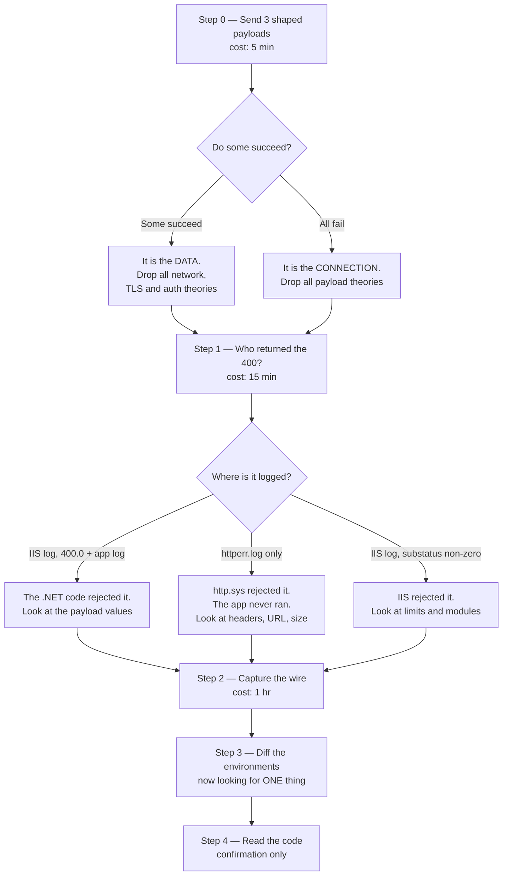
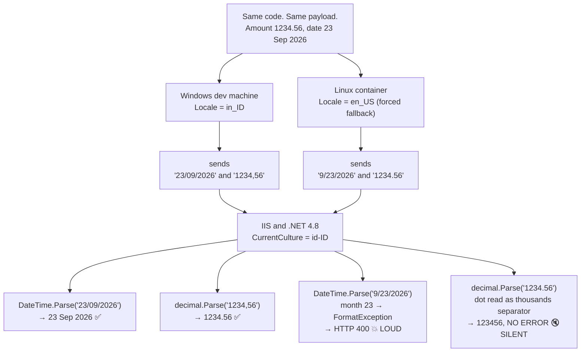

# Part 2 — Java ↔ .NET Debugging

A note on terms: this answer explains each technical term the first time it is used. The engineering is not simplified. Only the wording is.

A note on evidence: the numbers in section 2 are not from memory. I ran them in real containers while writing this answer, and the commands are included so they can be checked.

A note on experience: I have not personally lived this exact incident. So this answer is written as reasoning, not as a war story. Where I state a fact about the Java Virtual Machine, I measured it. Where I state a fact about .NET, I say plainly that it should be confirmed rather than trusted.

---

## Framing

The scenario is worth reading twice, because two details in it already cut the search space in half.

**Detail one: no code changed.** The same build, the same bytes, two machines. So the cause cannot be in the source. It must be something the process *reads from the world around it* — at startup or at runtime. That is a much smaller list than "anywhere in the code".

**Detail two: it returns HTTP 400, not a timeout and not a 500.** HTTP is the protocol the two services talk over. **400 means "Bad Request"** — the receiver is saying *you sent me something I will not accept*. It is not saying "I broke". So the request did arrive, and something about its content or shape was rejected.

But there is a trap inside detail two, and it shapes the whole answer: **a 400 can be returned by three completely different things**, and they look identical from the caller's side.

| Who answered | What it is | What it means |
|---|---|---|
| **http.sys** | The Windows kernel driver that accepts HTTP connections before any web server code runs | The request was rejected before Internet Information Services even saw it. Nothing appears in the web server's normal log. |
| **IIS** | Internet Information Services, Microsoft's web server | The web server rejected it — request too large, a module refused it, a limit was hit |
| **The .NET application** | The actual C# code | The application read the payload and did not like a value in it |

A caller sees `400` in all three cases. This is why section 1 starts where it does.

**Terms used throughout.** **JVM** is the Java Virtual Machine — the program that runs Java code. **JSON** is JavaScript Object Notation, the text format the payload is written in. A **locale** is a set of regional conventions: which character separates the whole part of a number from the fraction, what order day and month go in, what the month is called. .NET calls the same idea a **culture**. A **charset** is the rule for turning text into bytes and back.

---

## 1. What I would check first, and in what order

The ordering rule I use is not "check the most likely thing first". It is:

> **Order by how much of the search space a check removes, divided by what the check costs.**

A cheap check that eliminates half the possibilities beats an expensive check that confirms the thing you already suspect. Suspicion is the worst ordering principle, because a wrong suspicion sends you down a branch that can absorb a whole day and still end in nothing.

Here is the order, with nothing touched yet.

### Step 0 — Bound the failure. Does *every* request fail?

Before anything else, I want to know if the failure is total or partial. I would send three payloads from the container:

1. A plain one. Whole-number amount, ASCII-only text, a date on the 5th of a month.
2. The same, but with the date on the 23rd.
3. The same, but with an accented or non-Latin character in the free text.

This takes five minutes and needs no access to anything.

**Why this is first.** If payload 1 succeeds and payload 2 fails, the problem is *in the data*, not in the connection. That single result eliminates every network, certificate, authentication, proxy and firewall theory at once. Those theories are the expensive ones to investigate, and they are the ones a team usually starts with.

If *all three* fail, the opposite is true, and I would go hunting at the network and platform level instead.

The choice of "the 23rd" is deliberate, and section 4 explains why a date above the 12th is the sharpest test you can send.

### Step 1 — Find out **who** returned the 400

This is the check with the largest branch cut in the whole list.

If the request never reached the .NET code, then every theory about dates, decimals and text encoding is wasted effort. I want that settled before I think about payloads at all.

Three places to look, in order of how little they cost:

- **The response itself.** Does the 400 have a body? Does it carry a correlation identifier, or a `Server` header, or an IIS-style HTML error page? An empty body with no headers usually means it came from low down — http.sys, not the application.
- **The IIS site log**, under `C:\inetpub\logs\LogFiles\W3SVC<id>\`. I read two fields, not one: `sc-status` and `sc-substatus`. The substatus is the part people skip and it is where the real information is. `400.0` is generic; a non-zero substatus names the specific rule that rejected the request.
- **`httperr.log`**, under `C:\Windows\System32\LogFiles\HTTPERR\`. This is http.sys's own log. **If the request appears here and not in the IIS site log, the request never reached the web server at all**, and the reason phrase in that file (for example `BadRequest`, `FieldLength`, `RequestLength`) tells you which kernel-level rule fired.

**Why this order.** Reading a log costs minutes. Capturing traffic costs an hour and often needs permission. And the answer to "who returned the 400" removes either the entire application half of the problem or the entire infrastructure half.

### Step 2 — Capture what actually went on the wire

Only now do I look at the bytes, because now I know which half of the stack to look at.

The goal is one artefact: **the same logical request, captured from both machines, diffed line by line.** Not "what the code should produce". What actually left the machine.

I would capture on the container side, because that is the side I control and the side that changed.

```bash
# In the pod (or a temporary debug sidecar sharing its network).
# -A prints the packets as text. -s0 means do not truncate them.
tcpdump -i any -A -s0 'tcp port 8080 and host dotnet-api.internal' -w /tmp/cap.pcap

# Read it back with the HTTP request lines picked out.
tshark -r /tmp/cap.pcap -Y http.request -T fields \
       -e http.request.full_uri -e http.content_type -e http.file_data
```

Then the same from the Windows machine, and `diff` the two.

If the connection is encrypted with **TLS** (Transport Layer Security, the "s" in https), packet capture shows nothing readable. Then I would point the Java service at **mitmproxy** — a tool that sits in the middle and shows the decrypted request — for one test call, in a non-production environment only.

The cheap version, when none of that is available: log the exact request body and headers on the Java side, just before sending, from inside the container.

```java
// Illustrative. Apache HttpClient's own wire logging, switched on temporarily.
// logging.level.org.apache.http.wire = DEBUG
```

### Step 3 — Diff the two environments

Now I compare the two machines. Deliberately after the wire capture, not before.

**Why not first?** Because this step produces a long list of things that *are* different, and almost none of them are the cause. Windows and a Linux container differ in hundreds of ways. Without the wire capture in hand, you cannot tell which difference matters, and the list becomes a source of wrong suspicions rather than answers. With the capture in hand, you are looking for one specific thing.

The commands are in section 3.

### Step 4 — Only now, read the code

By this point I know which field is malformed and what the environment difference is. Reading the code is confirmation, not exploration. It should take minutes.

### The order as a diagram



### Summary of the ordering

| Step | Cost | What it removes |
|---|---|---|
| 0. Shaped payloads | 5 min | Either all network theories or all payload theories |
| 1. Who returned the 400 | 15 min | Either the whole application layer or the whole platform layer |
| 2. Wire capture | ~1 hour | All speculation about what the code "should" send |
| 3. Environment diff | 15 min | Narrows to the one setting that explains the captured bytes |
| 4. Read the code | minutes | Nothing. It confirms. |

---

## 2. Three real differences between a Windows machine and a Linux container

The brief suggests locale, timezone and character encoding. Those are three real answers, but naming them as three separate items hides the thing they have in common, and it leaves out a whole category of difference.

So I would group them by **where the difference lives**. Three layers. The brief's three all sit in the first one.

### Layer 1 — Values the JVM reads from the operating system at startup

The JVM does not have its own opinion about locale, timezone or character encoding. It asks the operating system once, at startup, and caches the answer for the life of the process.

```java
Locale.getDefault()        // regional conventions: decimal separator, date order
Charset.defaultCharset()   // how text becomes bytes
ZoneId.systemDefault()     // which timezone "now" means
```

Every no-argument formatting method in Java silently uses these. `String.format`, `NumberFormat.getInstance()`, `new SimpleDateFormat(...)`, `String.toUpperCase()`, `new String(bytes)`. None of them look dangerous. All of them change behaviour when the machine underneath changes.

**This is the layer that causes the bug in this scenario.**

#### What I actually measured

I ran a small probe class in real containers. Command and full output:

```bash
docker run --rm -v "$PWD":/w -w /w eclipse-temurin:11-jdk sh -c '
  env -u LANG java L.java                          # LANG removed entirely
  LC_ALL=id_ID.UTF-8 java L.java                   # ask for Indonesian
  java -Duser.language=id -Duser.country=ID L.java # force it at the JVM level
  locale -a'                                       # which locales exist in the image
```

| Environment | `Locale.getDefault()` | `Charset.defaultCharset()` | `String.format("%.2f", 1234.56)` | Short date, 23 Sep |
|---|---|---|---|---|
| Temurin 11, image default (`LANG=en_US.UTF-8`) | `en_US` | `UTF-8` | `1234.56` | `9/23/26` |
| Temurin 11, `LANG` removed entirely | `en_US` | `UTF-8` | `1234.56` | `9/23/26` |
| Temurin 11, `LC_ALL=id_ID.UTF-8` | `en_US` | **`US-ASCII`** | `1234.56` | `9/23/26` |
| Temurin 8, `LANG=C` | `en_US` | **`US-ASCII`** | `1234.56` | `9/23/26` |
| Temurin 11, `-Duser.language=id -Duser.country=ID` | `in_ID` | `UTF-8` | **`1234,56`** | **`23/09/26`** |

Two results here are not what most people expect, and both matter.

**Result one: the container lands on `en_US` no matter what you put in `LANG`.** Asking for `id_ID.UTF-8` did not work. The reason is in the last command: `locale -a` lists only `C`, `C.utf8`, `en_US.utf8` and `POSIX`. The image does not contain Indonesian locale data. The C library cannot honour the request, so the JVM falls back.

This **reverses the naive reading of the scenario**. It is tempting to assume the container is the machine producing a comma decimal separator. It is not. The container produces `1234.56`. The **Windows developer machine** is the one reading a regional setting and producing `1234,56`. Section 4 shows why that direction is what breaks.

**Result two: asking for a locale that does not exist does not fail. It silently downgrades the charset to `US-ASCII`.** Look at row three. The locale request was ignored, but the character encoding quietly became ASCII-only. Java 8 with the classic `LANG=C` does the same thing.

`US-ASCII` cannot represent `é`, `ü`, `ก` or `本`. Encoding them produces `?`. So free text arrives at the far end with question marks where the characters were, and **nothing anywhere reports an error**. There is no exception. This is the free-text trap, and it is live on Java 8 and Java 11.

**On Java 18 and later this specific trap is closed.** A change to the language (JEP 400) made the default charset UTF-8 regardless of what the operating system says. That is worth knowing, because it means this problem quietly stopped happening for teams on new Java — and **it did not close the locale trap**. `Locale.getDefault()` still reads the environment on every version. A team that upgraded Java and saw encoding bugs disappear may assume this whole family of bug is gone. It is not.

#### An extra result worth knowing: an explicit date pattern is still not safe

A common belief is that writing the date pattern out by hand makes you locale-proof. I tested it.

```bash
docker run --rm eclipse-temurin:11-jdk ... # same probe, several forced locales
```

| Forced locale | `SimpleDateFormat("dd/MM/yyyy")` | `SimpleDateFormat("dd MMM yyyy")` |
|---|---|---|
| `en_US` | `23/09/2026` | `23 Sep 2026` |
| `in_ID` | `23/09/2026` | `23 Sep 2026` |
| `th_TH` | `23/09/2026` | `23 ก.ย. 2026` |
| `ar_SA` | **`٢٣/٠٩/٢٠٢٦`** | `٢٣ سبتمبر ٢٠٢٦` |

The pattern is fixed, and the output still changes. Under an Arabic locale the *digits themselves* change to Arabic-Indic numerals. Under Thai the month name changes.

So an explicit pattern is not enough. **You need an explicit pattern *and* an explicit locale.** That distinction is the whole reason the fix in section 5 is written the way it is.

(A small curiosity in the table above: Java reports Indonesian as `in_ID`, not `id_ID`. Java has used the old `in` language code since before the standard changed to `id`, and kept it for backward compatibility. It is harmless, but it makes searching logs for "id_ID" find nothing.)

### Layer 2 — Things that are simply not inside the image

A Windows machine is a full operating system with everything installed. A container image is a deliberately minimal file system. Things you assume are present are often absent — and the failure mode is usually **quiet**, not loud.

| Missing thing | What breaks | How it looks |
|---|---|---|
| Locale data (`locale -a` shows four entries) | The requested locale is ignored, charset silently becomes `US-ASCII` | No error. Text turns into `?`. |
| `tzdata`, the timezone database | Timezone lookups fail or default to UTC | Dates shift by hours. On a slim or Alpine image this is common. |
| CA certificates (a **CA** is a Certificate Authority, the body that vouches for a server's identity) | TLS connections to an internal server fail | This one is loud — a handshake error, not a 400 |
| glibc vs musl (two different C libraries; Alpine images use musl) | Locale support is much weaker in musl, and some JVM behaviour differs | Subtle and hard to search for |

The theme of this layer is the dangerous part: **the container fails quietly where a full operating system would have had the data.** Layer 1 is where the JVM asks a question. Layer 2 is why the answer it gets back is wrong.

### Layer 3 — The container's identity on the network

This layer has nothing to do with data formatting, and it is the category the brief's three hints do not cover. It is where I would look if step 0 showed that *every* payload fails.

- **The source address is different.** A developer's machine is a specific workstation, on the corporate network, joined to the Windows domain. A pod's traffic leaves through a node or a network address translation gateway (**NAT** rewrites the source address of outgoing traffic). So an IIS address allow-list that permits the developer's subnet does not permit the container.
- **Windows Integrated Authentication stops working.** If the API uses NTLM or Kerberos, a domain-joined Windows machine authenticates automatically and invisibly. The developer never knew authentication was happening. A Linux container has no domain membership and cannot do it. This usually gives 401, but a Kerberos token that grows too large for http.sys's header limit gives a bare **400** with no body — which is exactly the symptom in the brief, and is why step 1 is not optional.
- **Name resolution differs.** The container has its own resolver configuration and search domains. A short hostname that resolved to the production API from the developer's machine may resolve to something else, or to nothing.
- **The clock can drift.** Containers inherit the host clock, but a signed request or a token with a short validity window fails if the two machines disagree about the time.
- **Memory limits are enforced differently.** A container has a **cgroup** limit — a hard ceiling the Linux kernel enforces. The JVM sizes its heap from that limit, not from the machine's total memory. A JVM that had 16 GB on the laptop may get a few hundred megabytes in the pod. That does not cause a 400, but it causes slowness and restarts that get blamed on the wrong thing.

**In this scenario, layer 3 is ruled out** — and ruling it out is exactly what step 0 and step 1 are for. If some payloads succeed, the connection is fine, the authentication is fine, and the name resolved correctly. That is a real answer, not a skipped step.

---

## 3. How I would confirm or rule out each one

### Layer 1 — the JVM's inherited values

The single most important detail: **run this against the pod that is actually failing, not a fresh one.** A container started by hand may have a different environment from one started by the orchestrator. That difference is often the bug.

```bash
# Ask the JVM to print its own settings. Needs no code change, no restart.
kubectl exec -it deploy/order-service -- \
  java -XshowSettings:properties -version 2>&1 \
  | grep -E 'user.language|user.country|user.timezone|file.encoding|sun.jnu.encoding'

# Ask the actual running process, not a new JVM. jcmd ships with the JDK.
kubectl exec -it deploy/order-service -- sh -c 'jcmd 1 VM.system_properties' \
  | grep -E 'user\.|file.encoding'

# What the operating system in the container thinks.
kubectl exec -it deploy/order-service -- sh -c 'locale; echo ---; locale -a; echo ---; date; echo ---; env | sort'
```

And the same three values on the Windows machine:

```powershell
java -XshowSettings:properties -version 2>&1 | Select-String "user.language|user.country|file.encoding"
Get-Culture        # the Windows regional setting the JVM will read
Get-TimeZone
```

**How to read the result.** If `user.language` differs between the two, layer 1 is confirmed and I move straight to section 4. If they are identical, layer 1 is ruled out and I stop thinking about locale entirely.

The one-liner I would use to see the values the code actually uses, rather than the raw properties:

```java
// Drop into a scratch file and run with `java Probe.java` inside the container.
public class Probe {
    public static void main(String[] a) {
        System.out.println(java.util.Locale.getDefault());
        System.out.println(java.nio.charset.Charset.defaultCharset());
        System.out.println(java.time.ZoneId.systemDefault());
        System.out.println(String.format("%.2f", 1234.56));
        System.out.println(java.text.DateFormat.getDateInstance(
                java.text.DateFormat.SHORT).format(new java.util.Date()));
    }
}
```

This is better than reading properties, because it shows the *consequence* rather than the input. `user.language=id` means nothing to a reviewer. `1234,56` means everything.

### Layer 2 — what is missing from the image

```bash
# Are any real locales installed? Four entries means effectively none.
kubectl exec -it deploy/order-service -- locale -a

# Is the timezone database present?
kubectl exec -it deploy/order-service -- sh -c 'ls /usr/share/zoneinfo | head; cat /etc/timezone'

# Are CA certificates present, and does the JVM trust the internal one?
kubectl exec -it deploy/order-service -- keytool -list -cacerts -storepass changeit | head

# glibc or musl? musl means weak locale support.
kubectl exec -it deploy/order-service -- sh -c 'ldd --version 2>&1 | head -1'
```

**How to read the result.** If `locale -a` shows only `C`, `C.utf8`, `POSIX` and one English entry, then any `LANG` or `LC_ALL` setting in the deployment file is decorative — it is being ignored. That is worth knowing on its own, because someone almost certainly believes it is working.

### Layer 3 — the network identity

```bash
# Does the name resolve to the same address from both machines?
kubectl exec -it deploy/order-service -- getent hosts dotnet-api.internal
#   on Windows: Resolve-DnsName dotnet-api.internal

# Can it connect at all, and what does a minimal request get back?
kubectl exec -it deploy/order-service -- \
  curl -sv -o /dev/null -w '%{http_code}\n' https://dotnet-api.internal/health

# What source address does the far end see?
kubectl exec -it deploy/order-service -- curl -s https://dotnet-api.internal/whoami

# Clock agreement.
kubectl exec -it deploy/order-service -- date -u    # compare with `Get-Date -AsUTC`
```

### On the Windows side

```powershell
# The IIS site log. Read sc-substatus, not just sc-status.
Get-Content C:\inetpub\logs\LogFiles\W3SVC1\u_ex*.log -Tail 200 |
    Select-String " 400 "

# http.sys's own log. If the request is HERE and not above, IIS never saw it.
Get-Content C:\Windows\System32\LogFiles\HTTPERR\httperr1.log -Tail 200
```

And the tool that makes this whole investigation short, if it is enabled: **Failed Request Tracing**. It is an IIS feature that records the full internal journey of a request — every module it passed through and which one rejected it — into an XML file you can open in a browser.

```powershell
# Capture every 400 on this site, with full detail.
Import-Module WebAdministration
Add-WebConfiguration /system.webServer/tracing/traceFailedRequests `
  -Value @{path='*'} -PSPath 'IIS:\Sites\OrderApi'
# then set statusCodes='400' on the failureDefinitions for that rule
```

### The confirmation table

| Difference | Command | Confirmed if | Ruled out if |
|---|---|---|---|
| JVM locale | `java -XshowSettings:properties -version` both sides | `user.language` / `user.country` differ | They match |
| JVM charset | Same command, `file.encoding` and `sun.jnu.encoding` | One says `US-ASCII` or `ANSI_X3.4-1968` | Both say `UTF-8` |
| JVM timezone | `ZoneId.systemDefault()` in the probe | One is `Etc/UTC`, the other is a named local zone | They match |
| Missing locale data | `locale -a` | Only four entries, while `LANG` asks for something else | The requested locale is listed |
| Missing tzdata | `ls /usr/share/zoneinfo` | Empty or absent | Populated |
| Network identity | `curl -v` and `getent hosts` from the pod | Different address, or connection refused | Same address, request completes |
| Who sent the 400 | `httperr.log` vs the IIS site log | Present in `httperr.log` only → http.sys | Present in the IIS log with a substatus → IIS or the app |

---

## 4. The cause, and the part nobody reported

### The mechanism: an accidental agreement

The payload is JSON, and the amounts and dates cross as **text**, not as JSON numbers and not in a standard date format:

```json
{
  "invoiceDate": "23/09/2026",
  "amount": "1234,56",
  "notes": "Pembayaran termin ke-2"
}
```

This shape is extremely common in older integrations. It matters here for a precise reason: **a real JSON number is parsed the same way everywhere.** The library .NET uses for JSON parses `1234.56` without consulting any culture setting. The moment a number crosses as a *string*, that protection is gone, and whatever the receiving code does with that string becomes culture-dependent.

So both sides were locale-dependent:

- **Java side.** Built the strings with no-argument formatters, which use `Locale.getDefault()`.
- **.NET side.** Read them with `decimal.Parse(s)` and `DateTime.Parse(s)`, which use the server's `CurrentCulture`.

And both machines were configured the same way — an Indonesian regional setting on the developer's Windows machine, and an Indonesian regional setting on the Windows server.

**So it worked. For years.** Not because the contract was correct, but because two independent misconfigurations happened to cancel each other out. Nobody was wrong in a way that showed.

Then the service moved into a container. The container has no Indonesian locale data, falls back to `en_US`, and the agreement breaks.

| Field | From the Windows dev machine (`in_ID`) | From the container (`en_US`) |
|---|---|---|
| `invoiceDate` | `23/09/2026` | `9/23/2026` |
| `amount` | `1234,56` | `1234.56` |

The server, still reading under an Indonesian culture, now receives day-first data in month-first order and comma-decimals written with a dot.



### The part that matters more than the 400

Look at the two failures on the right of that diagram. They are not the same kind of failure at all.

**The date fails loudly.** `9/23/2026` under an Indonesian culture means day 9, month 23. There is no month 23. It throws, and the application returns 400. That 400 is the reported symptom, and it is the thing the ticket is about.

**The amount does not fail at all.** Under an Indonesian culture the dot is the *thousands* separator. So `1234.56` is not rejected — it is read as the number **123456**. The parse succeeds. No exception, no warning, no 400. An invoice for 1,234.56 is stored as 123,456.

So:

> **The HTTP 400 is the lucky half of this bug. The half nobody reported is the dangerous one.**

Every payload dated between the 1st and the 12th of a month does not throw either — it silently swaps day and month. An invoice dated 9 March becomes 3 September.

This is why I would not treat "the 400 is fixed" as the end of the work, and it is why the fix in section 5 has to sit on both sides of the boundary. A fix that only stops the exception leaves the silent corruption running.

*(One honest caveat: the exact leniency of `decimal.Parse` with misplaced group separators is behaviour I would confirm in the actual environment rather than take on trust. It is the kind of detail that decides whether this is a reporting bug or a financial incident, so it deserves a two-minute test rather than my assertion. The general point — that a wrong separator convention can produce a wrong number instead of an error — does not depend on the exact case.)*

---

## 5. The fix, and where it belongs

### The principle

Everything below follows from one sentence.

> **The contract on the wire must be explicit. It must never be inherited from whatever machine the process happens to be running on.**

A value that means one thing on one machine and another thing on another machine is not a contract. It is a coincidence. The bug here was not that a setting was wrong. It was that **a setting was involved at all**.

### Java side — two stages, and the first one is not the fix

**Stage one, today: pin the values.** Something has to stop the bleeding while the real change is designed, reviewed and released.

```dockerfile
# Illustrative. Every environment now starts from the same place.
ENV JAVA_TOOL_OPTIONS="\
  -Duser.language=en -Duser.country=US \
  -Duser.timezone=UTC \
  -Dfile.encoding=UTF-8"
```

I want to be blunt about what this does and does not achieve.

**It makes the bug disappear without removing it.** The code is still locale-dependent. It has simply been pointed at a value I control instead of a value the machine supplies. That is genuinely better — it is reproducible, and it is the same everywhere — but the landmine is still in the code.

It has a specific cost too: **this setting is invisible to anyone reading the source.** A developer running the service outside that image, on a laptop or in a test harness, gets different behaviour and no clue why. So if I do this, it goes in the Dockerfile with a comment that says it is temporary and links to the ticket for stage two.

**Stage two, the actual fix: take locale out of the path entirely.**

```java
// Before — three locale-dependent calls, none of which look dangerous.
payload.put("amount", String.format("%.2f", invoice.amount()));
payload.put("invoiceDate", DateFormat.getDateInstance(DateFormat.SHORT).format(d));

// After — amounts as real JSON numbers, dates in ISO-8601.
payload.put("amount", invoice.amount());              // BigDecimal, serialized as a number
payload.put("invoiceDate", invoice.date().toString()); // LocalDate.toString() is ISO-8601
```

**ISO-8601** is the international standard date format — `2026-09-23`, always year-month-day, never ambiguous. `2026-09-23` cannot be read as anything else in any locale on earth. That is the entire point of using it.

Where a value genuinely must cross as text, the locale is named out loud:

```java
// Explicit pattern AND explicit locale. Section 2 showed why the pattern alone is not enough.
private static final DateTimeFormatter WIRE_DATE =
    DateTimeFormatter.ofPattern("yyyy-MM-dd", Locale.ROOT);

BigDecimal amount = new BigDecimal("1234.56");
String wire = amount.toPlainString();   // never locale-sensitive. Never String.format.
```

`Locale.ROOT` means "no region's conventions at all" — the neutral baseline. It is the right choice for anything that goes on a wire, and the wrong choice for anything shown to a human.

**And then stop it coming back.** This is the part that decides whether the fix survives the next two years of new joiners.

```java
// Illustrative. A build rule, not a code review convention.
@AnalyzeClasses(packages = "com.acme.integration")
class NoImplicitLocaleTest {
    @ArchTest
    static final ArchRule no_default_locale_formatting =
        noClasses().should().callMethod(String.class, "format", String.class, Object[].class)
            .orShould().callMethod(NumberFormat.class, "getInstance")
            .orShould().callConstructor(SimpleDateFormat.class, String.class)
            .because("these read Locale.getDefault(), which differs between Windows and the container");
}
```

A rule enforced by the build survives people leaving the team. A rule enforced by code review does not.

### .NET side — in order of value for risk

This is a legacy system. .NET Framework 4.8 is old, changing it is expensive, and every change carries risk. So the order below is itself the argument: I would push hardest for the change that costs least and helps most, and I would not lead with the one that looks like a one-line win.

**1. Make the 400 say why.** This is the change I would argue for first, and it is not even a correctness fix.

```csharp
// Illustrative. Instead of a bare 400.
if (!ModelState.IsValid)
    return BadRequest(ModelState);   // names the field and the value that failed
```

A bare 400 is what turned this into a multi-day investigation across two teams and two operating systems. A 400 that says `invoiceDate: '9/23/2026' is not a valid date` would have ended it in one reading of the response body — before anyone opened a packet capture.

It changes no behaviour, carries almost no risk, and it pays off on every future bug at this boundary, not just this one. In a legacy system that is the best ratio available.

**2. Parse with `TryParse` and `InvariantCulture` at every parse site.** This is the correctness fix.

```csharp
// Before — culture-dependent, and Parse means a bad value either throws or silently misreads.
decimal amount = decimal.Parse(dto.Amount);
DateTime date  = DateTime.Parse(dto.InvoiceDate);

// After — no culture in the path, and a bad value is a decision, not an accident.
if (!decimal.TryParse(dto.Amount, NumberStyles.Number,
                      CultureInfo.InvariantCulture, out var amount))
    return BadRequest($"amount: '{dto.Amount}' is not a valid decimal");

if (!DateTime.TryParseExact(dto.InvoiceDate, "yyyy-MM-dd",
                            CultureInfo.InvariantCulture,
                            DateTimeStyles.None, out var date))
    return BadRequest($"invoiceDate: '{dto.InvoiceDate}' must be yyyy-MM-dd");
```

**`TryParse`, not `Parse`, is the important half.** `Parse` has two failure modes: throw, or silently return a wrong number. `TryParse` with an explicit format has one: return false, which the code above turns into an explicit rejection. That is precisely the defect that let the amount corrupt quietly.

`TryParseExact` with a named format is stricter still. It will not accept `9/23/2026` *or* `23/09/2026`. Only the agreed shape. For a machine-to-machine boundary, refusing to guess is a feature.

**3. Reject ambiguity loudly — but stage it.** The end state is that the API accepts only ISO-8601 dates and invariant decimals, and returns a clear 400 for anything else.

That is a breaking change, so it needs a window:

- Release 1: accept both the old and the new shape. Log which one arrived, with the caller's identity.
- Wait until the log shows zero old-shape requests.
- Release 2: drop the old shape.

Skipping that window breaks every other caller of this API, including ones nobody remembers exist.

**4. What I would argue *against*: pinning the culture in `web.config`.**

```xml
<!-- The tempting one-line fix. I would not accept this as the answer. -->
<system.web>
  <globalization culture="en-US" uiCulture="en-US" />
</system.web>
```

This makes the symptom vanish immediately, which is exactly why it is dangerous. It has the same flaw as pinning the JVM locale — the code is still culture-dependent, just pointed somewhere fixed — and it has a **wider blast radius**, because `CurrentCulture` also controls how this application *formats* everything it outputs. Every report, every exported file, every number rendered on a screen that this same application serves. A change made to fix an integration silently reformats things no one was looking at.

As an emergency lever during an incident, with a rollback ready, it is acceptable. As the answer, it is not.

### The symmetry, which is the actual point

Look at what I rejected on each side:

| Side | The tempting one-line fix | Why it is not the answer |
|---|---|---|
| Java | `-Duser.language=en` in the Dockerfile | The code still depends on a locale. You moved the dependency, you did not remove it. |
| .NET | `<globalization culture="en-US" />` in web.config | Identical flaw, wider blast radius. |

**These are the same mistake, written in two languages.** Both make a machine setting the guarantor of correctness. Both work until someone changes a machine.

That symmetry is why my answer to "Java side, .NET side, or both?" is **both, and it has to be both**. Not because it is diplomatic. Because a one-sided fix leaves the same accidental-agreement structure in place, just with different values in it. The next platform move breaks it again.

The boundary is the thing that is broken here, not either service. That is the design concern.

### One sequencing note

**Fixing the Java side first, alone, makes things worse before better.** If Java starts sending `2026-09-23` while .NET still parses with `DateTime.Parse` under an Indonesian culture, previously-working requests start failing. So the order is forced:

1. .NET accepts both shapes (change 2 plus the first half of change 3).
2. Java switches to the explicit shape.
3. .NET drops the old shape once the logs are clean.

The compatibility window is not politeness. It is a requirement of the rollout order.

---

## 6. Where this answer is weak

- **The diagnosis assumes access to the Windows side.** If the .NET API belongs to another company or another department, `httperr.log`, the IIS logs and Failed Request Tracing are all unavailable. Steps 1 and 3 collapse, and the wire capture in step 2 becomes the only real lever — with a much slower loop, because every hypothesis needs an email.
- **Pinning the JVM locale hides the problem from the source.** I have said this above, but it is worth repeating as a weakness and not just a caveat. A developer reading the Java code will see nothing wrong, because the thing making it correct lives in a Dockerfile they may never open.
- **The build rule against implicit locale is a discipline problem.** ArchUnit catches the method calls it is told about. It will not catch a new locale-sensitive API, a call made through reflection, or one inside a third-party library. The rule holds while someone maintains it.
- **Nothing here detects the damage already done.** The silent decimal corruption has no alert and produces no error, so there is no log to search. Any invoice written since the container went live may be wrong by a factor of 100, and any date between the 1st and the 12th may have day and month swapped. **Finding and correcting those records is separate work**, and it is larger than the fix. I would name it as its own ticket rather than let "the 400 is fixed" imply it is handled.
- **I have not verified the .NET behaviour myself.** The Java measurements in section 2 are real and reproducible. The .NET claims in section 4 are reasoned from documented behaviour, and the most load-bearing of them — that a misplaced group separator produces a wrong number rather than an error — is the first thing I would test in the real environment before acting on this analysis.

---

## Summary of the trade

| Decision | What it buys | What it costs |
|---|---|---|
| Order checks by branch-cut ÷ cost, not by suspicion | Eliminates half the search space in the first ten minutes | Feels slow at the start, when everyone wants to fix something |
| Establish *who* returned the 400 before anything else | Stops a whole day being spent on the wrong half of the stack | Needs access to the Windows server's logs |
| Group differences by layer, not by name | Covers locale, timezone and encoding, and also catches the network-identity cases they miss | Less immediately skimmable than a list of three named things |
| Pin the JVM locale in the image | Stops the bleeding today, same behaviour everywhere | The code stays locale-dependent, and the reason is invisible in the source |
| Move amounts to JSON numbers and dates to ISO-8601 | Removes locale from the wire entirely; no configuration can break it | A breaking change, needing a compatibility window and a coordinated release |
| `TryParse` + `InvariantCulture` + exact format on .NET | Turns silent corruption into an explicit rejection | Every parse site has to be found; a legacy codebase may have many |
| Make the 400 name the field and the value | Would have ended this investigation in five minutes; helps every future bug here | Reveals a little more about the API's internals to its callers |
| Reject the two one-line "fixes" on both sides | Removes the accidental agreement instead of re-creating it with new values | Considerably more work than either one-liner, and harder to justify under delivery pressure |
