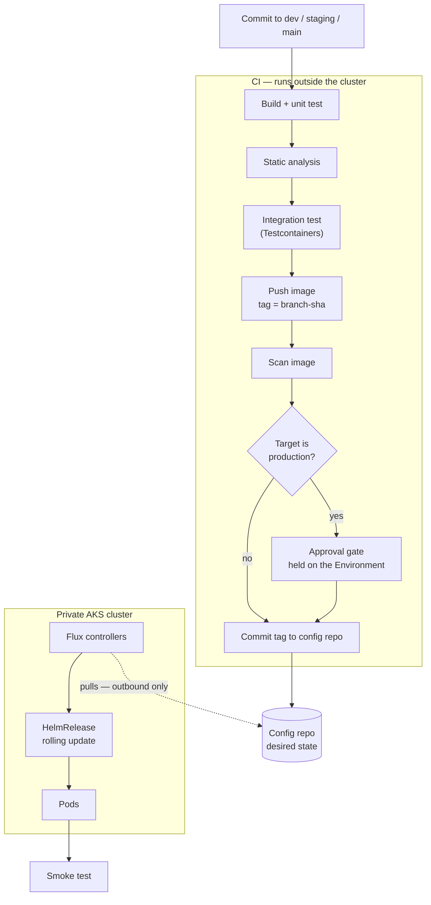
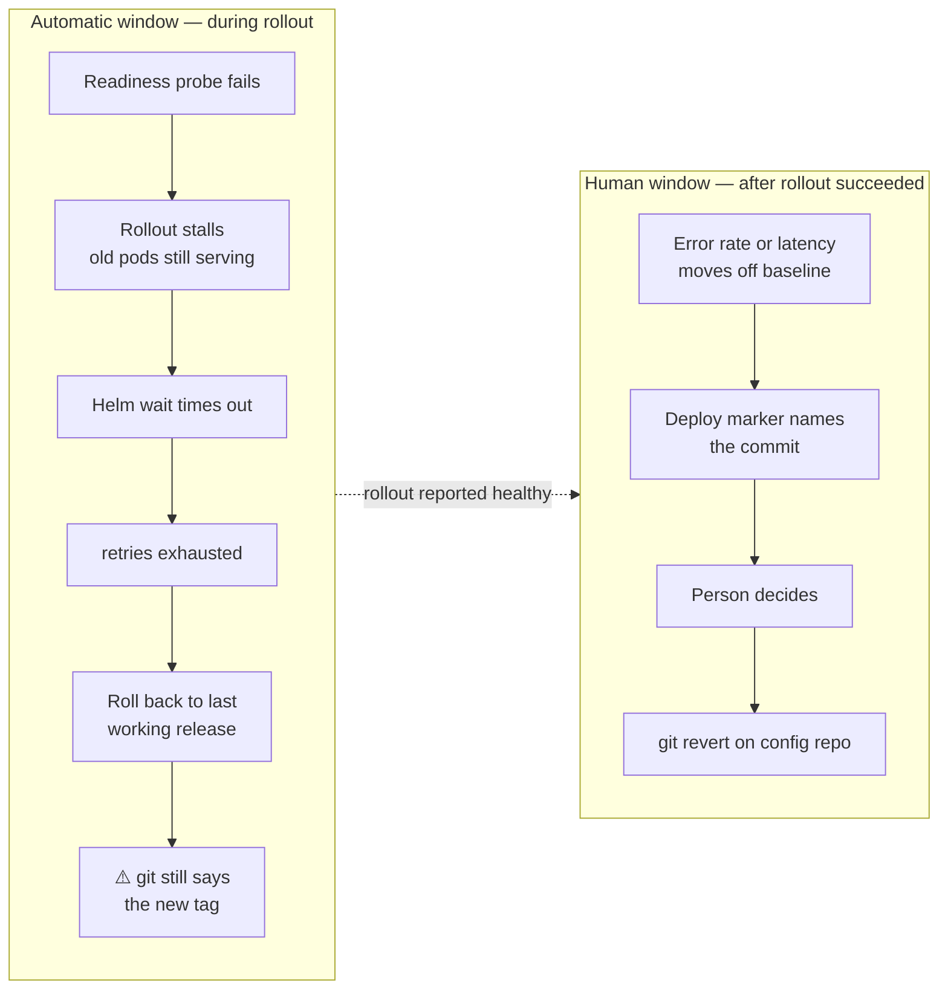

# Part 3 — CI/CD Pipeline Design

**CI/CD** means Continuous Integration and Continuous Delivery. Continuous Integration is the part that builds and tests every commit. Continuous Delivery is the part that takes a tested build and puts it into an environment.

A note on terms: this answer explains each technical term the first time it is used. The engineering is not simplified. Only the wording is.

A note on experience: the pipeline I ran end-to-end was **Cloud Build → gcr.io → Flux CD → GKE**, with **HashiCorp Vault** for secrets in every environment. GKE is Google Kubernetes Engine, their managed Kubernetes. The target here is **Azure DevOps → ACR → Flux CD → AKS** — ACR is Azure Container Registry, the place images are stored, and AKS is Azure Kubernetes Service. The delivery and secrets halves of the design do not change between those two, because neither Flux nor Vault is a cloud-provider feature. Only the build platform and the registry do. So I write this in the shape I actually ran, and section 5 maps every piece onto Azure DevOps, which is the internal standard named in the brief. Where a claim is lived, I say so. Where it is reasoned, I say that too.

A note on scope: I treat the service as **stateless** — it holds no database schema of its own that changes with a release. This is a real simplification and I would rather name it than hide it. A schema migration in the deploy path changes the rollback answer materially, and I say where in section 3.

---

## Framing

Two details in the brief decide most of this design before any tool is chosen.

**Detail one: the cluster is private.**

A *private* cluster means its **API server** — the control endpoint you send deploy commands to — has no public address. A hosted build agent on the internet cannot reach it. At all.

Most pipeline designs assume the opposite. They end with a step that runs `helm upgrade` or `kubectl apply` from the build agent. That step is a **push**: something outside the cluster reaches in. On a private cluster that step simply cannot connect, and the usual fix is to run your own build agent inside the cluster's network. That works, but it means the agent holds credentials that can change production.

So the single word "private" is what pushes this design to **GitOps**, described in section 1.

**Detail two: secrets must never be hardcoded.**

This is really two different problems that people answer as one:

| Problem | Example | Who needs it |
|---|---|---|
| Secrets the **pipeline** needs | registry login | the build agent |
| Secrets the **application** needs | database password, third-party API key | the running pod |

They have different answers, and the best answer to the second one is that **the value never enters the pipeline at all**. Section 2 is built around that, and the mechanism we used — Vault, reached by the pod's own cluster identity — takes it one step further: the pipeline cannot read the application's secrets even if someone wants it to.

---

## 1. Pipeline stages, from commit to production

### The shape: build pushes, cluster pulls

**GitOps** means the desired state of the cluster is written in a git repository, and something *inside* the cluster reads that repository and makes reality match it. Nothing outside the cluster is given power over it.

I used **Flux CD** for this — a set of controllers that run in the cluster, watch a git repository, and apply what they find. The flow is:

1. The pipeline builds and tests the code.
2. The pipeline pushes a container image to the registry.
3. The pipeline **commits the new image tag** into a separate config repository.
4. Flux, running in the cluster, notices the commit and applies it.

Step 4 is an outbound connection from the cluster. There is no inbound path, no firewall hole, and the build agent holds no cluster credentials. The private-cluster problem stops existing rather than getting worked around.

### The stages

| Stage | What runs | Blocks on | Rough time |
|---|---|---|---|
| Trigger | branch push | — | — |
| Build + unit test | Maven or Gradle, layered Docker build | any test failure | ~2 min |
| Static analysis | SonarQube, coverage threshold | quality gate | ~1 min |
| Integration test | Testcontainers — a real database in a container | any test failure | ~3 min |
| Push image | tag is `<branch>-<short-sha>`, never `latest` | — | ~1 min |
| Scan image | Trivy or registry scanning | policy on severity | ~1 min |
| Commit tag | write the tag into the environment's config | — | seconds |
| Flux sync | cluster pulls and rolls out | readiness probes | ~2 min |
| Smoke test | real HTTP calls against the deployed environment | failure triggers rollback | ~1 min |

Two notes on that table.

**Testcontainers** starts a real database inside a container for the duration of the test run. It matters because a mock agrees with whatever you assumed. A real database disagrees, which is the point of the test.

**The tag is never `latest`.** A tag that can be moved means the thing you tested and the thing that ran may be different, and you cannot tell afterwards. `<branch>-<short-sha>` names exactly one build forever.

### How a build reaches production

Three branches, three environments, promoted by **fast-forward merge only**:

```
dev  ──────▶ staging ──────▶ main
 │              │              │
 ▼              ▼              ▼
dev env     staging env     production
```

A fast-forward merge means staging cannot contain a commit that dev does not already have. The source tree is identical at each step. Nothing is re-written, re-ordered, or cherry-picked. This matters a great deal for section 6, where I defend rebuilding the image per environment.

### The approval gate

**One gate: after the staging soak, before production.** Everything before that is automatic.

Two things about it are deliberate.

**The gate belongs to the environment, not to the pipeline file.** In Azure DevOps this is an *Environment* with an approval check. In GitHub Actions it is an *environment* with required reviewers. The difference matters: a gate written as a step in the pipeline YAML can be removed by editing that YAML — in the very pull request that needs approving. A gate held on the environment is configured outside the repository and cannot be edited by the change it is guarding.

**The approver must have something to look at.** A gate where the reviewer has no evidence becomes a button someone clicks. So the gate presents the staging smoke test result, the soak window, and the commit range being promoted. If I cannot give the approver those three things, the gate is theatre and I would rather admit that than keep it.

### Diagram — the whole flow, and the trust boundary



The dotted arrow is the important one. It points *out* of the cluster. Nothing in the CI box holds a credential that can change production.

### The alternative I did not use

Flux has an **image-automation controller**. It can watch the registry itself and commit the new tag into git without the pipeline doing it. That removes the pipeline's write access to the config repository, which is a genuine security gain.

I did not use it, for one reason: the pipeline then has no idea when a deploy was requested. The approval gate has nowhere natural to sit, because the thing that starts the deploy is a controller reacting to a registry, not a person promoting a build. Having the pipeline commit the tag keeps the gate where a human can hold it.

---

## 2. Secrets across the three environments

### The principle

> The best handling of a secret is that the secret never touches the pipeline.

Anything the build agent can read, a careless `echo` in a build script can print into a log that a wide group of people can see. Removing the value from that path is worth more than protecting it while it is there.

### Runtime secrets — the mechanism

**HashiCorp Vault, reached through the Secrets Store CSI Driver, with the Kubernetes auth method.** This is what we ran, across all three environments.

Three pieces, each worth a sentence:

- **Vault** is HashiCorp's secret store. It runs as a service. Nothing reads from it without first proving who it is and being allowed by a policy.
- **CSI** is the Container Storage Interface — the standard way Kubernetes mounts storage into a pod. The **Secrets Store CSI Driver** uses it to mount a secret as a file. Vault plugs in behind it as a *provider*.
- **The Kubernetes auth method** is how the pod proves its identity, and it is the part worth understanding properly.

### How the pod proves who it is, without holding a credential

This is the piece that makes the design work, so it gets the plain-words version.

Every pod in Kubernetes already has a **ServiceAccount token** — a short-lived, signed file that the cluster gives it, saying "this pod is running as service account X in namespace Y". Nobody creates it, nobody stores it, and it expires on its own.

Vault is configured to trust that cluster. So the sequence is:

1. The driver takes the pod's ServiceAccount token.
2. It sends it to Vault and says: I want the role `orders`.
3. Vault asks the cluster's API server whether that token is genuine.
4. Vault checks its own rule for the role `orders` — is this service account, in this namespace, allowed to use it?
5. If yes, Vault returns a short-lived token with exactly one policy attached.
6. The driver fetches the secret and mounts it as a file. The application reads the file.

```bash
# Illustrative. The rule that says WHICH pod may use this role.
vault write auth/kubernetes/role/orders \
    bound_service_account_names=orders \
    bound_service_account_namespaces=orders-prod \
    policies=orders-read \
    ttl=1h
```

The result is the property I care about most: **there is no secret anywhere whose job is to fetch the secrets.** The identity is the pod's own existence in the cluster. Nothing to store, nothing to rotate, nothing to leak, and — the point section 4 returns to — **nothing to expire.**

### Keeping the three environments apart

We used **Vault namespaces**, a Vault Enterprise feature. A namespace is a fully separate Vault inside the same Vault — its own secrets, its own policies, its own auth configuration. A token issued in `dev` cannot name a path in `prod`. It is not a policy saying no; the path is not visible at all.

```yaml
# Illustrative. The pod names the namespace, the role, and the path. Never the value.
apiVersion: secrets-store.csi.x-k8s.io/v1
kind: SecretProviderClass
metadata:
  name: orders-prod
spec:
  provider: vault
  parameters:
    vaultAddress: 'https://vault.internal:8200'
    vaultNamespace: 'prod'          # Enterprise namespace. dev cannot see this one.
    roleName: 'orders'              # the role from the vault write above
    objects: |
      - objectName: "db-password"   # becomes the filename in the pod
        secretPath: "kv/data/orders/db"
        secretKey: "password"
```

The secrets themselves are static, held in Vault's **KV v2** store — a versioned key/value store. I should be plain that this is the ordinary half of Vault. Its stronger feature is **dynamic secrets**, where Vault creates a short-lived database user per workload and revokes it afterwards, so a leaked credential is worthless within the hour. We did not use that. It is the first thing I would move towards, and section 6 says why we had not.

### Which people may read which environment

Everything above is about **machines** — a pod fetching its own secret. People need a separate answer, on the same namespaces. A reasonable one looks like this:

| Environment | Who can read it |
|---|---|
| dev | every engineer |
| staging | leads and above |
| production | engineering managers, and rarely |

Vault supports this, but there is a trap in how it does, and it is worth saying out loud.

**A namespace is isolation, not permission.** Creating a `prod` namespace denies nobody. It only means that policies, auth methods and tokens inside it are separate from every other namespace. The access rules still have to be written. The namespace is what makes them impossible to confuse with another environment's rules.

So each namespace gets its own login, pointed at the company's existing identity provider, and a group mapping:

```bash
# Illustrative. Done per namespace. Each namespace has its own auth mount.
VAULT_NAMESPACE=prod vault auth enable oidc
VAULT_NAMESPACE=prod vault write identity/group \
    name="eng-managers" type="external" policies="prod-read"
```

The membership list is **not** kept in Vault. It is a group in the company directory, which is where joiners and leavers are already handled. One change there, and Vault follows. A user list maintained inside Vault goes stale the first time someone changes team.

**The caveat, which is the same shape as the root token problem.** Namespaces form a tree, and the isolation runs **downward only**. A child namespace cannot see its parent or its siblings — that is the guarantee this design rests on. But a parent can administer its children, and the top-level namespace reaches all of them. So "only managers can read production" is true against engineers working in dev. It is not true against whoever administers the namespace above it, normally the platform team. The boundary is real, and it sits *below* those people rather than around them.

**Membership is the blunt tool, and I would not stop there.** If the manager is the only person who can read a production secret, then at three in the morning during an incident, the secret is unreadable. Vault Enterprise has **Control Groups** for exactly this: a lead may request the secret, and Vault withholds it until a manager approves.

```hcl
# Illustrative. The lead can ask. One manager must approve before Vault releases it.
path "kv/data/orders/db" {
    capabilities = ["read"]
    control_group = {
        factor "ops_manager" {
            identity {
                group_names = ["eng-managers"]
                approvals = 1
            }
        }
    }
}
```

That gives the same control, keeps a way in during an emergency, and leaves a record of who asked, who approved and when. Gatekeeping by membership gives only the first of those three.

One opinion to close this, because it matters more than the mechanism: **if anyone needs to read a production secret often, the design is wrong somewhere else.** The right question is not "who is allowed" but "how often does a person need to, and why". A good answer to the second question makes the first one much less important.

### Pipeline secrets — a separate problem

Registry login and the config repo commit use the build platform's own **OIDC** (OpenID Connect — a standard way one system proves its identity to another) federation, not a stored key.

Keeping these out of Vault is deliberate. The pipeline runs outside the cluster, so it has no ServiceAccount token, so the clean Vault story above does not apply to it. Making it a Vault client would mean giving it a credential to hold — the exact thing the runtime design avoids. So the pipeline gets registry access and nothing else.

**The pipeline is never a Vault client.** It cannot read the database password even if someone asks it to. That is the strongest single sentence I can say about this design.

### Blast radius if one thing leaks

| What leaks | What the holder can reach |
|---|---|
| A dev pod's ServiceAccount token | the `dev` Vault namespace only, and it expires on its own |
| A production pod's token | the `prod` namespace, only paths in the `orders-read` policy, only from inside the cluster |
| The pipeline's federated credential | push to the registry and commit to the config repo — **not** Vault, **not** the cluster |
| The config repo | can request a deploy, which the approval gate still stops for production |

No single leak reaches production data. The one that comes closest — a production pod's token — is already the thing that is supposed to read that secret, expires by itself, and is useless outside the cluster.

The honest exception is Vault's own root token and unseal keys. Those do reach everything, in every environment. They are not part of the pipeline and they were not mine, but a design is not complete because the dangerous thing sits outside the diagram, so section 6 names it.

### What I would argue against

Storing the database password in a pipeline variable group marked "secret", and injecting it at deploy time.

It is better than hardcoding. It is not the answer. The value still passes through the build agent, still sits in the memory of a process running arbitrary build scripts, and has no rotation story — rotating it means editing a pipeline variable by hand and hoping nothing else referenced it. I would accept it as a step on the way, with a ticket, and not as the destination.

---

## 3. What happens when production fails its health checks

### The automatic part, and exactly how far it reaches

Flux runs the release as a **HelmRelease**. Helm is Kubernetes' package manager; a HelmRelease is Flux's object for "keep this Helm release installed and current".

```yaml
# Illustrative. This is the entire automatic-rollback answer, in six lines.
apiVersion: helm.toolkit.fluxcd.io/v2
kind: HelmRelease
spec:
  upgrade:
    remediation:
      retries: 2                   # retry the upgrade twice
      remediateLastFailure: true   # then roll back to the last working release
  rollback:
    timeout: 5m
    cleanupOnFail: true
```

The sequence: the new pods start, the **readiness probe** (Kubernetes asking the pod "can you serve traffic yet?") never passes, the rolling update stalls, Helm's wait times out, and `helm-controller` rolls back to the previous release.

Note what protects you during all of this: Kubernetes removes old pods only as new ones become ready. If the new pods never become ready, the old ones are never removed. **The service does not go down while this is happening.** That is Kubernetes doing the work, not Flux. Flux's contribution is deciding to give up and revert.

One value deserves a sentence of its own: **`retries: 0` means no remediation at all.** It looks like a reasonable default. It silently turns the whole safety net off.

### What this does not catch

"Automatic rollback" is a smaller promise than it sounds.

| It catches | It does not catch |
|---|---|
| the application not starting | a wrong business result |
| missing or malformed configuration | an endpoint that got ten times slower |
| a bad or missing image | an error that only appears under real traffic |
| a dependency unreachable at boot | a bug in a path the smoke test does not touch |

Everything in the right column starts *after* the rollout finished successfully. The automatic window has closed. A probe cannot see any of it, because a probe only asks "are you up".

### So what triggers rollback after that window?

A person reading a graph. That is not a weak answer, but it places a requirement on the pipeline: make that person's job possible, and their rollback fast.

- **Deploy markers** annotated on the dashboards, so a graph that turns bad can be tied to a specific commit within seconds rather than by asking in chat.
- **Alerting on error rate and latency compared to the pre-deploy baseline**, not against a fixed threshold. A fixed threshold either fires constantly or never fires.
- **Rollback is one command**, because the previous image tag still exists in the registry and the previous desired state is the previous commit. Rollback is `git revert` on the config repo.

That last point is the real benefit of GitOps, beyond solving the private-cluster problem: **rollback uses exactly the same mechanism as deploy.** It is exercised every day. It is not a special emergency path that nobody has run since it was written.

### The part most answers miss

When helm-controller rolls back, the cluster returns to the last working release — but **git still says the new tag**. The two now disagree, and the HelmRelease sits in a failed state.

So the automatic rollback is not the end of the incident. Someone still has to revert the commit. Until they do, the recorded desired state is wrong, and the next unrelated change reconciles on top of that. "It rolled back" and "it is resolved" are two different things, and treating them as one is how a cluster ends up quietly out of step with its own repository.

### Diagram — the two windows



### The caveat I owe you

All of this holds because I scoped the service as stateless. With a database schema migration in the deploy path, reverting the code does not revert the schema, and an old version of the application may not run against a new schema. The answer there is expand/contract — every migration additive, the old and new versions both able to run against the same schema, and the destructive half deferred to a later release. That is a real piece of work and I am flagging it rather than pretending the rollback above covers it.

---

## 4. A real pipeline incident

### What happened

On the Cloud Build → gcr.io → GKE pipeline, two failures in the same class, at different times.

The first: the build environment ran out of capacity. The second: a service account credential expired.

Both presented the same way — "the pipeline is broken" — with a confusing error deep in the run. Neither was a code problem. Both blocked everyone's releases, not just the person who happened to push.

### What I did

I diagnosed it, unblocked the team with a workaround, and escalated to the infrastructure team who owned the runners and the service accounts. They fixed it reasonably fast.

### What I changed afterwards, so it would not happen again

**Nothing durable. And that is the honest answer.**

The runner fleet was not mine. The service account was not mine. I could resolve the instance and I could not touch the class. So the same failure could have come back, and the only thing standing between us and that was somebody else's backlog.

### The lesson, which is about boundaries and not about disks

A dependency on another team sitting inside the release path is itself a pipeline design flaw.

Escalation fixes the instance. The class recurs until the boundary moves. I did not see it that way at the time — I saw two unrelated infrastructure problems. They were one problem: **the pipeline had a failure mode that my team could detect but not fix.**

### What I would do now

1. **Remove the expiring thing.** OIDC federation for the pipeline's registry access, instead of a stored service account key. A credential that does not exist cannot expire. This is the one that removes a failure class rather than softening it — and it is the same principle the runtime design in section 2 already gets right, which is the irony: **the application's secrets had no stored credential anywhere, and the pipeline's did.** The strong pattern was already in the building. Nobody had carried it across the boundary.
2. **Preflight the run.** A first step that checks credential validity and available capacity before anything expensive starts. The difference between a clear message in ten seconds and a confusing one in six minutes is most of the cost of these incidents.
3. **Make expiry and quota monitored facts with an owner.** Not things discovered at release time by whoever pushed.
4. **Agree explicitly with the platform team which failures my team may fix directly.** This is the real fix. The other three are mitigations that make a cross-team wait shorter and more predictable; only this one removes the wait.

I would not claim I did any of that. I am describing what I now think the incident was actually telling us.

---

## 5. The same pipeline in Azure DevOps

Azure DevOps is the standard named in the brief. Everything above maps onto it directly.

### Concept mapping

| What I ran (Google Cloud) | Azure DevOps | GitHub Actions |
|---|---|---|
| Cloud Build trigger | pipeline `trigger` on branch | `on: push` |
| `cloudbuild.yaml` steps | `stages` → `jobs` → `steps` | `jobs` → `steps` |
| gcr.io | **ACR** — Azure Container Registry | GHCR or ACR |
| Registry auth via stored key | **OIDC service connection** | OIDC federated credentials |
| Manual approval | **Environment** with approval check | environment with required reviewers |
| GKE | **AKS** | AKS |
| **Vault + CSI + Kubernetes auth** | **Vault + CSI + Kubernetes auth** | **Vault + CSI + Kubernetes auth** |
| **Flux CD** | **Flux CD** | **Flux CD** |

The last two rows map to themselves, and they are the most interesting ones. Because delivery is GitOps and secrets come from Vault through the cluster's own identity, **neither of them is a cloud-provider feature.** Swapping Cloud Build for Azure DevOps rewrites the top half of the diagram and nothing below the config repo.

That is worth stating as a choice rather than a coincidence. Using Vault instead of the cloud's native secret store costs something real — an extra system to run, seal, unseal and upgrade, which a managed store would have given for free. What it buys is that the secrets design does not have to be rebuilt when the cloud changes, and it works the same way for a cluster that is not in that cloud at all. For a product sold to multiple client organisations, which may not all run in the same place, that is the trade I would make again.

### Azure DevOps pipeline, as pseudocode

```yaml
# Illustrative pseudocode. Names and tasks are indicative, not copy-ready.
trigger:
  branches: { include: [dev, staging, main] }

variables:
  imageTag: '$(Build.SourceBranchName)-$(Build.SourceVersion)'

stages:
- stage: Build
  jobs:
  - job: BuildTest
    steps:
    - task: Maven@4          # unit tests
    - task: SonarQubeAnalyze@5
    - script: ./mvnw verify  # integration tests, Testcontainers
    - task: Docker@2
      inputs:
        containerRegistry: 'acr-connection'   # service connection, OIDC. No stored key.
        repository: 'orders'
        command: 'buildAndPush'
        tags: '$(imageTag)'
    - script: trivy image --exit-code 1 --severity HIGH,CRITICAL acr.io/orders:$(imageTag)

# DeployDev and DeployStaging are the same shape as below, with no approval
# on their environments. Omitted here.

- stage: DeployProd
  condition: eq(variables['Build.SourceBranchName'], 'main')
  jobs:
  - deployment: WriteTag
    environment: 'production'                  # ← the approval check lives HERE,
    strategy: { runOnce: { deploy: { steps:    #   configured outside this file
      - script: |
          yq -i '.image.tag = "$(imageTag)"' clusters/prod/orders/values.yaml
          git commit -am "prod: orders $(imageTag)" && git push
      - script: ./smoke-test.sh https://orders.internal
    }}}
```

The comment on `environment: 'production'` is the whole approval answer. The check is attached to the environment in the Azure DevOps interface. It is not in this file, so a pull request that edits this file cannot remove it.

### What does not transfer, honestly

- **ACR private endpoints.** Reaching a private registry from a hosted agent has its own network story that I have not built.
- **Azure RBAC.** Role-Based Access Control — how permissions are granted. Azure's model is shaped differently from Google Cloud's IAM (Identity and Access Management, its equivalent), and I would expect my first attempt at scoping the pipeline's service connection to be wrong in ways I cannot predict from here.
- **Self-hosted agents in Azure DevOps.** I have not run an agent pool. GitOps means I mostly do not need one, which is part of why I chose it.
- **Running Vault on AKS rather than GKE.** The Kubernetes auth method works the same way, because it depends on Kubernetes and not on the cloud. What I would need to redo is the storage and high-availability setup underneath Vault, and the unseal mechanism — those are cloud-specific, and they were not mine on either platform.

I would rather name these than imply the transfer is free.

---

## 6. Where this answer is weak

**Rebuilding the image per environment is the most arguable choice here.** Each environment builds its own image from its own branch, rather than one image being built once and promoted unchanged.

The defence is real, and it rests on three things together:

1. Promotion is **fast-forward merge only**, so the source tree at staging is identical to the one tested at dev. Not similar. Identical.
2. The build is **pinned** — base image by digest, dependencies locked — so the rebuild is intended to produce the same bytes.
3. That claim is **checkable**: compare the image digests across the three environments and they should match.

And the limit is just as real. If the digests differ, production is running bytes that were never tested, and **nothing tells you** — the pipeline is green either way. The defence depends entirely on a check that most teams, including the one I was on, never actually run.

So I would keep the model and add the check: a pipeline step that compares the digest against the one built for the previous environment, and fails loudly when they diverge. That turns a belief into a verified property. Without it, "the rebuild is deterministic" is a hope. If the check turned out to fail often, that would be the argument for switching to build-once-and-promote, and I would take it.

**I have not run this on Azure.** The design transfers. The operational surprises do not, and section 5 names the ones I expect.

**Vault moves the hardest secret rather than removing it.** Everything in section 2 is true about the application's secrets, and none of it is true about Vault's own root token and unseal keys. Those reach every secret in every environment, and they cannot themselves be held in Vault. In practice they live in a sealed process owned by the platform team, split between several people. I did not own that, and I am naming it because a design that quietly leaves its most dangerous credential outside its own diagram is not finished — it has just drawn a smaller diagram.

**The secrets are static, and that is the weakest part of the design.** A password held in KV v2 stays valid until a person changes it. If it leaks, nothing expires and nothing notices. Vault's answer to this is the database secrets engine, which issues a short-lived database user per workload and revokes it on a timer, so a leaked credential is worthless within the hour. We did not use it, for the ordinary reason: it requires Vault to hold privileged access to the database and the application to cope with credentials that change underneath it, and neither was in scope. **It is the single change I would push for first.** The rest of section 2 is good hygiene; this one would remove a class of risk.

**GitOps adds a component to operate.** Flux is controllers running in the cluster. They can break. When they do, deploys stop **silently** — the pipeline still goes green, because its job ended when it pushed the commit. That is a specific and nasty failure mode: **a green pipeline no longer means a deploy happened.** The mitigation is alerting on Flux's own reconciliation status, not on the pipeline's exit code, and it needs to exist from day one rather than after the first silent failure.

**Smoke tests give false confidence.** They test the paths someone thought to write down, which is close to the set of paths already least likely to break.

**There is no load or performance gate anywhere in this pipeline.** A change that is correct and ten times slower passes every gate described above, and is caught by the human window in section 3 — that is, by someone noticing.

---

## 7. Speed, and knowing whether the deploy worked

### Speed is a correctness property

The budget above is roughly ten minutes from commit to staging, and that number is not arbitrary. Past about ten minutes, people stop waiting and start something else. A pipeline people do not wait for is a pipeline people work around — they batch changes, they push and leave, they stop reading the result.

What buys the time: Docker layer caching, a cached dependency directory, and running static analysis and integration tests in parallel rather than in sequence.

The honest trade: **caching is the most common source of "it works in CI and fails in production".** A stale cache means you tested something you did not ship. So caches are keyed on the content of the lock file, never on the branch name, and the production build ignores the cache entirely — slower, on the one build where slowness costs least.

### "Pods are running" is not "the deploy worked"

Three things close that gap:

- **Deploy markers** on the dashboards, so a graph that turns bad names its commit.
- **Error rate and latency compared against the pre-deploy baseline**, not a fixed number — the comparison is what makes it meaningful.
- **The running version exposed on a health endpoint.** So the question "what is actually in production right now" is answered by asking production, not by trusting the pipeline's own report of what it did. Those two disagree more often than anyone expects, and section 3 gives one reason why: after an automatic rollback, they disagree by design.

---

## Summary of the trade

| Decision | What it buys | What it costs |
|---|---|---|
| GitOps with Flux, cluster pulls | Solves the private cluster with no inbound path; no cluster credential outside the cluster; rollback is the same mechanism as deploy | Another component to operate, and a green pipeline stops meaning a deploy happened |
| Rebuild per environment from a branch | Simple mental model; the branch is the single source of truth; identical source at every stage via fast-forward merge | Equivalence is assumed unless a digest check is added; without it, divergence is silent |
| Vault + CSI driver + Kubernetes auth | No credential exists whose job is to fetch credentials; the pipeline is not a Vault client at all; portable off one cloud | A whole extra system to run and keep sealed, where a managed store would be free |
| Vault namespaces per environment | A dev token cannot name a production path — the path is invisible, not merely refused; and human access rules per environment cannot be confused with each other | Needs Vault Enterprise, and the isolation runs downward only — whoever administers the namespace above still reaches all three |
| Control Groups for human reads of production | Keeps a way in during an incident, and records who asked and who approved | Another Enterprise feature, and an approval path someone must be awake to answer |
| Static KV v2 secrets | Simple, and the same shape every application already expects | Gives up Vault's best feature; a leaked value stays valid until someone notices |
| Automatic rollback, bounded window | Catches every start-up failure without a human; the service never goes down while it happens | Catches nothing after the rollout succeeds, and leaves git disagreeing with the cluster |
| One approval gate, held on the environment | Cannot be removed by the pull request it is guarding | A gate with no evidence attached becomes a rubber stamp |
| Treating the service as stateless | Keeps the rollback answer honest and simple | Schema migrations need expand/contract, which this answer flags and does not solve |
| Naming the incident as a boundary problem | Identifies the failure class rather than two unrelated events | Requires admitting I changed nothing durable at the time |
